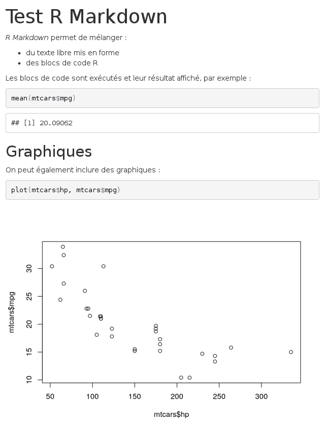
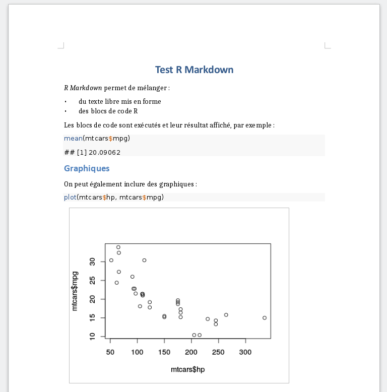
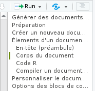
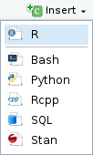

```{r setup, include=FALSE}
knitr::opts_chunk$set(echo = TRUE, results="hide", fig.keep = "none", cache = T)
```

Le but de ces séances est d’apprendre à utiliser R dans des cas concrets, à produire un rapport reproductible, et à représenter des données avec R de manière optimale. Vous aborderez également l’analyse de données.

Il y aura 3 séances de 4h de TP consacrées à R :

 * 13 mars (après-midi)
 * 24 avril (après-midi)
 * 26 avril (matin)

Ce document servira pour les 3 séances.

Il a été largement inspiré du site suivant, dans lequel vous pourrez également trouver (en anglais) des exemples d'application des tests statistiques du type de ce que vous avez pratiqué en biostatistiques. http://www.cyclismo.org/tutorial/R/ , ainsi que de ce tutoriel en français http://larmarange.github.io/analyse-R/.

Vous progresserez à votre rythme et pour ceux qui iront le plus vite un autre document les attendront.

# Objectif du TP

A la fin de ces 3 séances de TP, vous devrez être capable de maitriser tous les points énumérez ci-dessous:


* Faire une analyse reproductible en utilissant un fichier Rmarkdown (.Rmd)
    * Connaitre les bases de la syntaxe Markdown (md)
    * rédiger un fichier .Rmd
    * compiler un fichier .Rmd

* Savoir utiliser Rstudio
    * Savoir se déplacer dans l'arborescence de son ordinateur
    * Maitriser le concept de dossier de travail

* Importer des données provenant d'un fichier dans un tableau (data.frame)
    * .csv, .tsv (Fichier texte, qui contient un tableau dont les colonnes sont espacées par des virgules ou des tabulations)
    * .xlsx (Fichier excel)

* Savoir explorer un tableau ou data.frame
    * Connaitre le nombre de lignes, de colonnes
    * Recupér des statistiques récapitulatives, moyenne, minimum, maximum, d'une ligne/colonne

* Manipuler les tableaux
    * Selectionner une partie d'un tableau en fonction de critères
         * sur une autre colonne
         * sur une liste
    * Faire des opérations simples
         * Fusionner des tableaux
         * Rajouter une ligne ou une colonne qui contient le résultat d'un calcul (ex, somme ou moyenne d'une ligne/colonne)
    
 
* Maitriser les bases du language R:
    * Connaitre et savoir utiliser les différents types de bases (nombre entier, chaine de caractères, facteur, vecteur, tableau, matrice, ...)
    * Savoir installer et charger des extensions (library)
    * Savoir écrire une fonction
    * Savoir maitriser les fonctions de la famille "apply"
    * Savoir utiliser des instructions (condition if, boucle for et while, ...)
    * Faire des graphiques
  

    
> Pas de panique,  les étudiants des années précedentes y sont arrivés ! De plus cette liste poura faciliter vos révisions et vous aider à identifier les points à travailler.

    

#  Rstudio et le RMarkdown


## Instalation de R et Rstudio 

Pour commencer le Tp, vous avez besoin d'un ordinateur avec R et Rstudio d'opérationnel.

R et Rstudio sont déja installés sur les ordinateurs des salles de TP. Pour l’installer sur votre ordinateur personnel, voir
la page du CRAN http://cran.r-project.org/bin/.

Vous devrez également installer RStudio https://www.rstudio.com/products/rstudio/download/

## Le Rmarkdown c'est quoi ?!!

L'extension `rmarkdown` permet de générer des documents de manière dynamique en mélangeant texte mis en forme et résultats produits par du code R. Les documents générés peuvent être au format HTML, PDF, Word, et bien d'autres. C'est donc un outil très pratique pour l'exportation, la communication et la diffusion de résultats d'analyse.

Il permet de mettre dans un même document du code R et du texte formaté sans trop se soucier de la forme.
Par exemple, ce document est lui même un fichier .Rmd. 

Basiquement un fichier .Rmd est un fichier texte avec des balise pour indiquer si le texte est un titre, du texte simple ou du code.
Ensuite en compilant ce fichier, vous pourrez obtenir un fichier html, pdf ou word avec le texte mis en forme, le code R et le résulat du code R.

De nombreux turoriels très complets sont disponibles sur internet par exemple :
 
 * https://juba.github.io/tidyverse/13-rmarkdown.html (version originale et conplète dont est extraite cette partie)
 * https://www.rstudio.com/wp-content/uploads/2015/02/rmarkdown-cheatsheet.pdf (un résumé en anglais)


Voici un exemple de document R Markdown minimal :


```{r echo = FALSE, comment = ""}
cat(htmltools::includeText("data/resources/rmarkdown/minimal_sample.Rmd"))
```

Ce document peut être "compilé" sous différents formats. Lors de cette étape, le texte est mis en forme, les blocs de code sont exécutés, leur résultat ajouté au document, et le tout est transformé dans un des différents formats possibles.

Voici le rendu du document précédent au format `HTML` :



Le rendu du même document au format `PDF` :


Et le rendu au format `docx` :



Les avantages de ce système sont nombreux :

- le code et ses résultats ne sont pas séparés des commentaires qui leur sont associés
- le document final est reproductible
- le document peut être très facilement régénéré et mis à jour, par exemple si les données source ont été modifiées.

### Créer un nouveau document `.Rmd`

Un document R Markdown est un simple fichier texte enregistré avec l'extension `.Rmd`.

Sous RStudio, on peut créer un nouveau document en allant dans le menu *File* puis en choisissant *New file* puis *R Markdown...*. La boîte de dialogue suivante s'affiche :


On peut indiquer le titre, l'auteur du document ainsi que le format de sortie par défaut (il est possible de modifier facilement ces éléments par la suite). Plutôt qu'un document classique, on peut aussi choisir de créer une présentation sous forme de slides (entrée *Presentation*) ou de créer un document à partir d'un modèle (Entrée *From Template*).

Un fichier comportant un contenu d'exemple s'affiche alors. Vous pouvez l'enregistrer où vous le souhaitez avec une extension `.Rmd`.


### Éléments d'un document R Markdown

Un document R Markdown est donc un fichier texte qui ressemble à quelque chose comme ça :

```{r echo = FALSE, comment = ""}
cat(htmltools::includeText("data/resources/rmarkdown/sample_Rmd.Rmd"))
```

On va décomposer les différents éléments constitutifs de ce document.

#### En-tête (préambule)

La première partie du document est son *en-tête*. Il se situe en tout début de document, et est délimité par trois tirets (`---`) avant et après :

    ---
    title: "Titre"
    author: "Prénom Nom"
    date: "10 avril 2017"
    output: html_document
    ---

Cet en-tête contient les métadonnées du document, comme son titre, son auteur, sa date, plus tout un tas d'options possibles qui vont permettre de configurer ou personnaliser l'ensemble du document et son rendu. Ici, par exemple, la ligne `output: html_document` indique que le document généré doit être au format HTML.


#### Texte du document

Le corps du document est constitué de texte qui suit la syntaxe *Markdown*. Un fichier Markdown est un fichier texte contenant un balisage léger qui permet de définir des niveaux de titres ou de mettre en forme le texte. Par exemple, le texte suivant :

    Ceci est du texte avec *de l'italique* et **du gras**.
    
    On peut définir des listes à puces :
    
    - premier élément
    - deuxième élément
    
Génèrera le texte mis en forme suivant :    
    
Ceci est du texte avec de l'*italique* et du **gras**.

On peut définir des listes à puces :
 
- premier élément
- deuxième élément
On voit que des mots placés entre des astérisques sont mis en italique, des lignes qui commencent par un tiret sont transformés en liste à puce, etc.

On peut définir des titres de différents niveaux en faisant débuter une ligne par un ou plusieurs `#` :

```
# Titre de niveau 1
## Titre de niveau 2
### Titre de niveau 3
```

Quand des titres ont été définis, si vous cliquez sur l'icône *Show document outline* totalement à droite de la barre d'outils associée au fichier R Markdown, une table des matières générée automatiquement à partir des titres s'affiche et vous permet de naviguer facilement dans le document :




La syntaxe Markdown permet d'autres mises en forme, comme la possibilité d'insérer des liens ou des images. Par exemple, le code suivant :

    [Exemple de lien](https://example.com)

Donnera le lien suivant :

[Exemple de lien](https://example.com)

Dans RStudio, le menu *Help* puis *Markdown quick reference* donne un aperçu plus complet de la syntaxe.

#### Blocs de code R

En plus du texte libre au format Markdown, un document R Markdown contient, comme son nom l'indique, du code R. Celui-ci est inclus dans des blocs (*chunks*) délimités par la syntaxe suivante :


```{r echo = FALSE, comment = ""}
cat(htmltools::includeText("data/resources/rmarkdown/code_chunk.Rmd"))
```

Comme cette suite de caractères n'est pas très simple à saisir, vous pouvez utiliser le menu *Insert* de RStudio et choisir *R*, ou utiliser le raccourci clavier `Ctrl+Alt+i`.



Dans RStudio les blocs de code R sont en général affichés avec une couleur de fond légèrement différente pour les distinguer du reste du document.

Quand votre curseur se trouve dans un bloc, vous pouvez saisir le code R que vous souhaitez, l'exécuter, utiliser l'autocomplétion, exactement comme si vous vous trouviez dans un script R. Vous pouvez également exécuter l'ensemble du code contenu dans un bloc à l'aide du raccourci clavier `Ctrl+Maj+Entrée`.

Dans RStudio, par défaut, les résultats d'un bloc de code (texte, tableau ou graphique) s'affichent directement *dans* la fenêtre d'édition du document, permettant de les visualiser facilement et de les conserver le temps de la session.

Lorsque le document est "compilé" au format HTML, PDF ou docx, chaque bloc est exécuté tour à tour, et le résultat inclus dans le document final, qu'il s'agisse de texte, d'un tableau ou d'un graphique. Les blocs sont liés entre eux, dans le sens où les données importées ou calculées dans un bloc sont accessibles aux blocs suivants. On peut donc aussi voir un document R Markdown comme un script R dans lequel on aurait intercalé du texte libre au format Markdown.

> À noter qu'avant chaque compilation, une nouvelle session R est lancée, ne contenant aucun objet. Les premiers blocs de code d'un document sont donc souvent utilisés pour importer des données, exécuter des recodages, etc.


#### Compiler un document (*Knit*)

On peut à tout moment compiler, ou plutôt "tricoter" (*Knit*), un document R Markdown pour obtenir et visualiser le document généré. Pour cela, il suffit de cliquer sur le bouton *Knit* et de choisir le format de sortie voulu :


Vous pouvez aussi utiliser le raccourci `Ctrl+Maj+K` pour compiler le document dans le dernier format utilisé.

> Pour la génération du format PDF, vous devez avoir une installation fonctionnelle de `LaTeX` sur votre système. Si ça n'est pas le cas, l'extension `tinytex` de Yihui Xie vise à faciliter l'installation d'une distribution `LaTeX` minimale quel que soit le système d'exploitation de votre machine. Pour l'utiliser il vous faut d'abord installer l'extension avec `install.packages('tinytex')`, puis lancer la commande suivante dans la console (prévoir un téléchargement d'environ 200Mo) : `tinytex::install_tinytex()` Plus d'informations sur [le site de tinytex](https://yihui.name/tinytex/).

Un onglet *R Markdown* s'ouvre dans la même zone que l'onglet *Console* et indique la progression de la compilation, ainsi que les messages d'erreur éventuels. Si tout se passe bien, Le document devrait s'afficher soit dans une fenêtre *Viewer* de RStudio (pour la sortie HTML), soit dans le logiciel par défaut de votre ordinateur.

### Personnaliser le document généré

Pour personalisé vos document vous pouvez aller lire la sute de ce tutoriel sur la page de son auteur: https://juba.github.io/tidyverse/13-rmarkdown.html


# C'est partie

Pour continuer le TP, vous allez avoir besoin de télécharger ce document afin de le compléter.

https://github.com/msemon/TPRBioinfo/archive/master.zip

Ce dossier contient:

 * un fichier `Tp_R_L3Bioinfo.Rmd`, ce document que l'on pourra appeler fichier maitre
 * un dossier `data` qui contient tous les fichiers utilisés par ce document maitre.

Vous pouvez ouvrir le fichier `Tp_R_L3Bioinfo.Rmd` dans Rstudio et retrouver ce paragraphe et commencer les choses sérieuses !

Vérifier que le fichier compile bien (en appuyant sur le bouton `Knit`) si ce n'est pas le cas appeler un professeur.

Puis à chaque fois que vous ferez une modification (ou quelques unes) je vous conseille de compiler pour être sûre que tout fonctionne. 

> C'est vraiment partie cette fois ci, vous allez faire du R. Continuez de lire ce document pas à pas, n'hésitez pas à executer le code, modifiez le pour être sûre d'avoir bien compris, prenez le temps de faire les exercices. Si vous avez des questions ou que vous bloquez, n'hésitez pas à appeler un professeur.


# Importer des données

## Premier contact

Nous allons commencez par tapez notre première commande en R pour executez de simples opérations arithmétiques.

Pour commencer executer ce chunk avec la petite flèche verte dasn Rstudio

```{r}
1 + 2
```

Puis créer de nouveaux chunks avec différentes opérations:
  - soustraction
  - multiplication
  - division

Faire des opérations arithmétiques, c’est bien, mais sans doute pas totalement suffisant. Notamment, on aimerait pouvoir réutiliser le résultat d’une opération sans avoir à le resaisir ou à le copier/coller.

Comme tout langage de programmation, R permet de faire cela en utilisant des objets. Prenons tout de suite un exemple :

```{r}
x <- 2
```

Que signifie cette commande ? L’opérateur `<-` est appelé opérateur d’assignation. Il prend une valeur quelconque à droite et la place dans l’objet indiqué à gauche. La commande pourrait donc se lire mettre la valeur 2 dans l’objet nommé `x`.

Il existe trois opérateurs d’assignation sous R. Ainsi les trois écritures suivantes sont équivalentes :

```{r}
x <- 2
x = 2
2 -> x
```

Cependant, pour une meilleure lecture du code, il est conseillé de n’utiliser que `<-`. Ainsi, l’objet créé est systématiquement affiché à gauche. De plus, le symbole = sert également pour écrire des conditions ou à l’intérieur de fonctions. Il est donc préférable de ne pas l’utiliser pour assigner une valeur (afin d’éviter les confusions).

On va ensuite pouvoir réutiliser cet objet dans d’autres calculs ou simplement afficher son contenu :

```{r}
x + 3
```

Si vous voulez obtenir une liste des variables que vous avez définies dans une session particulière, vous pouvez les lister toutes en utilisant la commande ls:

```{r}
ls()
```

##  Importer des valeurs manuellement

Nous avons vu comment affecter un nombre à une variable mais si l'on veut stocker plusieurs valeurs, la manière la plus simple est d'utiliser la commande `c` (pour «combiner»).

Les nombres dans la commande `c` sont séparés par des virgules. A titre d'exemple, nous pouvons créer une nouvelle variable, appelée "bubba" qui contiendra les numéros 3, 5, 7 et 9:


```{r}
bubba <- c(3,5,7,9)
```

Lorsque vous entrez cette commande, vous ne devriez voir aucune sortie sauf un ">" indiquant un appel à une nouvelle ligne de commande. La commande a pourtant créé une liste de nombres appelés "bubba". Pour voir quels numéros sont inclus dans bubba tapez "bubba" et appuyez sur la touche Entrée:

```{r}
bubba 
```

Si vous souhaitez travailler avec l'un des nombres stocker, vous pouvez y accéder en utilisant la variable, puis les crochets indiquant l'indice:

```{r}
bubba[2]
bubba[1]
bubba[0]
```

Notez que la première entrée correspond au numéro 1 et que le zéro peut être utilisé pour indiquer comment l'ordinateur traitera les données. Vous pouvez stocker des chaînes de caractère à l'aide de guillemets simples et doubles, et vous pouvez stocker des nombres réels.

Si vous souhaitez récupérer plusieurs éléments vous pouvez spécifier plusieurs indices:

```{r}
bubba[1:3]
bubba[c(1,3,4)]
```

## Importation de valeurs à partir d'un fichier

Il est rare d'avoir juste quelques points de données. Il est beaucoup plus commun d'avoir beaucoup de données avec des relations compliquées. Ici, nous allons examiner comment lire un jeu de données à partir d'un fichier, mais nous devons d'abord discuter du format d'un fichier de données.

Nous supposons que le fichier de données est au format appelé "comma separated values" (csv). C'est-à-dire que chaque ligne contient une rangée de valeurs qui peuvent être des nombres ou des lettres, et chaque valeur est séparée par une virgule. Nous supposons également que la toute première rangée contient une liste d'étiquettes qui font référence aux différentes colonnes de valeurs.

La commande pour lire un fichier de données est read.csv. Nous devons donner à la commande au moins un argument (le nom du fichier), mais nous allons donner deux arguments optionnels supplémentaires. Le premier argument indique si la première ligne contient les noms des colonnes. Le deuxième argument indique qu'il y a une virgule entre chaque numéro de chaque ligne. La commande suivante va lire dans les données et l'assigner à une variable appelée "heisenberg". Lorsque vous utilisez la commande read.csv, R utilise un type spécifique de variable appelé "data frame". Toutes les données sont stockées sous la forme de colonnes séparées. 

```{r}
heisenberg <- read.csv(file="data/exemples/simple.csv",head=TRUE,sep=",")
heisenberg
```

Pour obtenir plus d'informations sur les différentes options disponibles, vous pouvez utiliser la commande help:

```{r}
?read.csv
```

Si R ne trouve pas le fichier que vous essayez de lire, il se peut qu'il recherche dans le mauvais dossier/répertoire.

Par exemple si vous executer ce code:

```{r, eval=FALSE}
heisenberg <- read.csv(file="simple.csv",head=TRUE,sep=",")
heisenberg
```
Vous aller obtenir l'erreur:

"impossible d'ouvrir le fichier 'simple.csv' : Aucun fichier ou dossier de ce type"

En effet ce fichier est dans le dossier "exemples" lui même dans le dossier "data". Il faut donc lui donner le chemin complet entre le dossier de tarvail et le fichier cible, donc ici "data/exemples/simple.csv".

Pour connaitre le dossier de travail il faut exécuter la commande `getwd()` dans un chunk.

```{r, echo=FALSE}
getwd()
```

Par default le dossier de travail d'un fichier .Rmd est celui qui contient le fichier. Par contre, le dossier de travail de la console est la base de votre arborescence de fichier. Exécuter directement la commande `getwd()` dans la console. Vous devriez avoir un résulat différent.
C'est normal mais c'est une subtilité qu'il faut connaître.

Dans Rstudio, vous pouvez modifier le répertoire de travail en utilisant la commande `setwd()` ou bien dans le petit panel en bas a droite, vous pouvez choisir un dossier puis selectionner "More" et "Set as Working Directory".

Si vous n'êtes pas sûrs des fichiers qui se trouvent dans le répertoire de travail actuel, vous pouvez utiliser la commande `dir()` pour lister les fichiers du répertoire de travail actuel:

```{r}
dir()
```


Après cette petite apparté sur le dossier de travail, nous revenons à notre table et notre variable "heisenberg".

Pour connaitre les noms des colonnes de notre tableau, on peut utiliser, entre autres, la commande colnames() ou head() pour afficher les début dut tableau.

```{r}
colnames(heisenberg)
```

```{r}
head(heisenberg)
```

La variable "heisenberg" contient donc un tableau avec trois colonnes. Chaque colonne reçoit un nom basé sur l'en-tête (la première ligne du fichier). Vous pouvez maintenant accéder à chaque colonne en utilisant un "$":

```{r}
heisenberg$trial
heisenberg$mass
heisenberg$velocity
```

et buis même les stocker dans d'autres variables

```{r}
a<-heisenberg$trial
b<-heisenberg$mass
c<-heisenberg$velocity
```


> une autre manière d'importer les données d'un fichier, est d'utiliser l'interface graphique de Rstudio, File > Import Dataset > From Csv et de récupérer les lignes de commandes dans la section "code preview".


## Les extensions (library)

###  Présentation
L'installation par défaut du logiciel **R** contient le cœur du programme ainsi qu'un ensemble de fonctions
de base fournissant un grand nombre d'outils de traitement de données et d'analyse statistiques.

**R** étant un logiciel libre, il bénéficie d'une forte communauté d'utilisateurs qui peuvent librement
contribuer au développement du logiciel en lui ajoutant des fonctionnalités supplémentaires. Ces contributions
prennent la forme d'"extensions" (packages en anglais) pouvant être installées par l'utilisateur 
et fournissant alors diverses fonctionnalités supplémentaires.

Il existe un très grand nombre d'extensions (plus de 6500 à ce jour), qui sont diffusées par un réseau
baptisé **CRAN**.

La liste de toutes les extensions disponibles sur **CRAN** est disponible ici :
<http://cran.r-project.org/web/packages/>.

###  Installation

L'installation d'une extension se fait par la fonction `install.packages`, 
à qui on fournit le nom de l'extension. Par exemple, si on souhaite installer l'extension **readr** :

```{r}
install.packages("readr", dep=TRUE)
install.packages("questionr", dep=TRUE)
```

L'option `dep=TRUE` indique à **R** de télécharger et d'installer également toutes les extensions dont
l'extension choisie dépend pour son fonctionnement.

Sous **RStudio**, on pourra également cliquer sur *Install* dans l'onglet *Packages* du quadrant
inférieur droit.

Une fois l'extension installée, elle peut être appelée depuis la console ou un fichier script avec la fonction `library` ou la fonction `require` :

```{r, eval=FALSE}
library(readr)
```

À partir de là, on peut utiliser les fonctions de l'extension, consulter leur page d'aide en ligne, accéder
aux jeux de données qu'elle contient, etc.

Pour mettre à jour l'ensemble des extensions installées, la fonction `update.packages suffit :

```{r, eval=FALSE}
update.packages()
```

Sous **RStudio**, on pourra alternativement cliquer sur *Update* dans l'onglet *Packages* du quadrant
inférieur droit.


Si on souhaite désinstaller une extension précédemment installée, on peut utiliser la fonction
`remove.packages`:

```{r, eval=FALSE}
remove.packages("readr")
```

> Il est important de bien comprendre la différence entre `install.packages` et `library`.
> La première va chercher les extensions sur internet et les installe en local sur le disque dur de l'ordinateur. On n'a besoin d'effectuer cette opération qu'une seule fois. 
> La seconde lit les informations de l'extension sur le disque dur et les met à disposition de **R**.
> On a besoin de l'exécuter à chaque début de session ou de script.

## Exercices

Nous allons étudier un autre exemple dans la suite de ce tutoriel. Le fichier de données a été créé par un groupe à Oak Ridge National Laboratory. Les données d'origine sont données dans une feuille de calcul Excel. 

La feuille de calcul d'origine se trouve à l'adresse http://cdiac.ornl.gov/ftp/ndp061a/trees91.wk1 (ou dans data/exemples)
Une description du fichier de données se trouve à http://cdiac.ornl.gov/ftp/ndp061a/ndp061a.txt.

Ouvrir ce fichier et regarder comment est ce qu'il est construit.

Dans R, il est facile d'importer un tableau au format `csv` ou excel mais il faut que le tableau soit composé de l'ensemble des lignes, or dans ce tableau il y a des lignes d'entête qui vont gêner l'importation des données.

Supprimer ces lignes, enregister le tableau sous format `csv` via votre tableur (excel ou libreoffice)


Les données contiennent des estimations de la biomasse de pin ponderosa dans une étude réalisée par Dale W. Johnson, J. Timothy Ball et Roger F. Walker (Université du Nevada). La table contient 54 lignes, et chaque ligne représente une observation. Chaque observation comprend des mesures et des marqueurs pour 28 mesures différentes d'un arbre donné. Par exemple, le premier chiffre de chaque rangée est un nombre, 1, 2, 3 ou 4, qui indique un niveau différent d'exposition au dioxyde de carbone. Le sixième nombre dans chaque rangée est une estimation de la biomasse des tiges d'un arbre. Notez que la toute première ligne du fichier est une liste d'étiquettes utilisées pour les différentes colonnes de données.


Les données peuvent être lues dans une variable appelée "tree" en utilisant la commande read.csv. Allez-y!

```{r}

#ajouter ici les commandes pour lire le fichier tree91
#tree<-

```


Cela créera une nouvelle variable appelée "tree". Si vous tapez "tree"  dans la console et que vous appuyez sur Entrée, tous les éléments stockés dans la variable seront affichés. Essayez!

```{r, eval=FALSE}
tree
```


# Les structures élémentaires

Nous allons maintenant voir les différents classes de base de R, c'est a dire les différentes structures d'objets que nous allons pouvoir utiliser.

## Les vecteurs

Nous allons reprendre plusieurs éléments de base du langage **R** que nous avons déjà abordé mais de manière plus formelle. Une bonne compréhension des bases du langage, bien qu'un peu ardue de prime abord, permets de comprendre le sens des commandes que l'on utilise et de pleinement exploiter la puissance que **R** offre en matière de manipulation de données.

### Présentation des vecteurs

Les "vecteurs" sont l'un des objets de bases de **R** et correspondent à une "liste de valeurs". Leurs propriétés fondamentales sont :

- les vecteurs sont unidimensionnels (i.e. c'est un objet à une seule dimension, à la différence d'une matrice par exemple) ;
- toutes les valeurs d'un vecteur sont d'un seul et même type ;
- les vecteurs ont une longueur qui correspond au nombre de valeurs contenues dans le vecteur.

### Les principaux types de vecteurs

Dans **R**, il existe quatre types fondamentaux de vecteurs : 

- les "nombre réel" (c'est-à-dire les nombres décimaux que nous utilisons au quotidien), 
- les "nombres entiers", 
- les "chaîne de caractères" (qui correspondent à du texte) et 
- les "valeur logique" ou "valeur booléenne", à savoir "vrai" ou "faux".

Pour connaître la nature d'un objet, le plus simple est d'utiliser la fonction `class`. Par exemple :

```{r}
class(12.5)
```

La réponse `"numeric"` nous indique qu'il s'agit d'un nombre réel. Parfois, vous pourrez rencontrer le terme `"double"` qui désigne également les nombres réels. Notez que **R** étant anglophone, la décimale est indiquée avec un point (`.`) et non avec une virgule comme c'est l'usage en français.

Essayons avec un nombre entier :

```{r}
class(3)
```

Sous **R**, lorsqu'on l'on tape un nombre sans autre précision, il est considéré par défaut comme un nombre réel. Pour indiquer spécifiquement que l'on veut un nombre entier, il faut rajouter le suffixe `L` :

```{r}
class(3L)
```

Au quotidien, il arrive rarement d'avoir à utiliser ce suffixe, mais il est tonjour bon de le connaître au cas où vous le rencontriez dans des manuels ou des exemples de code.

Pour saisir une chaîne de caractères, on aura recours aux doubles guillemets droits (`"`) :

```{r}
class("abc")
```

Il est également possible d'utiliser des guillemets simples (`'`), dès lors que l'on utilise bien le même type de guillemets pour indiquer le début et la fin de la chaîne de caractères (par exemple `'abc'`).

Enfin, les valeurs logiques s'indiquent avec `TRUE` pour vrai et `FALSE` pour faux. Il est aussi possible d'utiliser les raccourcis `T` et `F`. Attention à bien utiliser les majuscules, **R** étant sensible à la casse.

```{r}
class(TRUE)
```

En résumé, les classes **R** des quatre types fondamentaux de vecteur sont :


Exemple | Classe R  | Type 
:------ |:----------|:-------------
`5L` | <dfn lang="en">integer</dfn>   | nombre entier
`3.14` | <dfn lang="en">numeric</dfn>   | nombre réel
`"abcd"` | <dfn lang="en">character</dfn> | chaîne de caractères
`TRUE` | <dfn lang="en">logical</dfn>   | booléenne

En plus des types de base, il existe de nombreuses autres classes de vecteurs dans **R** que nous aborderons ultérieurement dans d'autres parties tels que les facteurs.

### Création

#### La fonction c

Pour créer un vecteur, on utilisera la fonction `c`, la lettre "c"</q>" étant un raccourci du mot anglais "combine" puisque cette fonction permet de combiner des valeurs individuelles dans un vecteur unique. Il suffit de lui passer la liste des valeurs à combiner :

```{r}
taille <- c(1.88, 1.65, 1.92, 1.76)
taille
class(taille)
sexe <- c("h", "f", "h", "f")
sexe
class(sexe)
urbain <- c(TRUE, TRUE, FALSE, FALSE)
urbain
class(urbain)
```

Nous l'avons vu, toutes les valeurs d'un vecteur doivent obligatoirement du même type. Dès lors, si l'on essaie de combiner des valeurs de différents types, **R** essaiera de les convertir au mieux. Par exemple :

```{r}
x <- c(2L, 3.14, "a")
x
class(x)
```

Dans le cas présent, toutes les valeurs ont été converties en chaînes de caractères.

#### La fonction rep

Dans certaines situations, on peut avoir besoin de créer un vecteur d'une certaine longeur mais dont toutes les valeurs sont identiques. Cela se réalise facilement avec `rep` à qui l'on indiquera la valeur à répéter puis le nombre de répétitions :

```{r}
rep(2, 10)
```

On peut aussi lui indiquer plusieurs valeurs qui seront alors répétées en boucle :

```{r}
rep(c("a", "b"), 3)
```

#### La fonction seq

Dans d'autres situations, on peut avoir besoin de créer un vecteur contenant une suite de valeurs, ce qui se réalise aisément avec `seq` à qui l'on précisera les arguments `from` (point de départ), `to` (point d'arrivée) et `by` (pas). Quelques exemples valent mieux qu'un long discours :

```{r}
seq(1, 10)
seq(5, 17, by = 2)
seq(10, 0)
seq(100, 10, by = -10)
seq(1.23, 5.67, by = 0.33) 
```

#### L'opérateur :

L'opérateur `:` est un raccourci de la fonction `seq` pour créer une suite de nombres entiers. Il s'utilise ainsi :

```{r}
1:5
24:32
55:43
```

Nous verrons un peu plus loin que ce raccourci est fort pratique.

### Longueur d'un vecteur

Un vecteur dispose donc d'une "longueur" qui correspond aux nombres de valeurs qui le compose. Elle s'obtient avec `length`:

```{r}
length(taille)
length(c("a", "b"))
```

Il est possible de faire un vecteur de longeur nulle avec `c()`. Bien évidemment sa longueur est zéro.

```{r}
length(c())
```

### Quelques vecteurs remarquables

**R** fournit quelques vecteurs particuliers qui sont directement accessibles :

- `LETTERS` : les 26 lettres de l'alphabet en majuscules
- `letters`: les 26 lettres de l'alphabet en minuscules
- `month.name` : les noms des 12 mois de l'année en anglais
- `month.abb` : la version abrégée des 12 mois en anglais
- `pi` : la constante mathématique &pi;

```{r}
LETTERS
letters
length(letters)
month.name
month.abb
length(month.abb)
pi
length(pi)
```

### Combiner des vecteurs

Pour combiner des vecteurs, rien de plus simple. Il suffit d'utiliser `c` ! Les valeurs des différents vecteurs seront mises bout à bout pour créer un unique vecteur.

```{r}
x <- c(2, 1, 3, 4)
length(x)
y <- c(9, 1, 2, 6, 3, 0)
length(y)
z <- c(x, y)
z
length(z)
min_maj <- c(letters, LETTERS)
min_maj
length(min_maj)
```

### Valeurs manquantes

Lorsque l'on travaille avec des données d'enquêtes, il est fréquent que certaines données soient manquantes, en raison d'un refus du participant de répondre à une question donnée ou d'un oubli ou d'un dystonctionnement du matériel de mesure, etc.

Une valeur manquante s'indique sous **R** avec `NA` (pour _not available_). Cette valeur peut s'appliquer à n'importe quel type de vecteur, qu'il soit numérique, textuel ou logique.

```{r}
taille <- c(1.88, NA, 1.65, 1.92, 1.76, NA)
taille
sexe <- c("h", "f", NA, "h", NA, "f")
sexe
```

Les valeurs manquantes sont prises en compte dans le calcul de la longeur du vecteur.

```{r}
length(taille)
```

Il ne faut pas confondre `NA`{data-pkg="base"} avec un autre objet que l'on rencontre sous **R** et appelé `NULL`{data-pkg="base"} qui représente l'"objet  vide". `NULL` ne contient absolument rien du tout. La différence se comprends mieux lorsque que l'on essaie de combiner ces objets :

```{r}
c(NULL, NULL, NULL)
length(c(NULL, NULL, NULL))
```

On peut combiner `NULL` avec `NULL`, du vide plus du vide renverra toujours du vide dont la dimension est égale à zéro.

```{r}
c(NA, NA, NA)
length(c(NA, NA, NA))
```

Par contre, un vecteur composé de trois valeurs manquantes a une longueur de 3, même si toutes ses valeurs sont manquantes.


### Indexation des vecteurs

L'"indexation"" est l'une des fonctionnalités les plus puissantes mais aussi les plus difficiles à maîtriser de **R**. Il s'agit d'opérations permettant de sélectionner des sous-ensembles de valeurs en fonction de différents critères. Il existe trois types d'indexation :

 * (i) l'indexation par position,
 * (ii) l'indexation par nom et
 * (iii) l'indexation par condition.
 
Le principe est toujours le même : on indique entre crochets (`[]`) ce que l'on souhaite garder ou non. 

#### Indexation par position

Commençons par l'"indexation par position". Ce mode le plus simple d'indexation consiste à indiquer la position des éléments à conserver.

Reprenons notre vecteur `taille` :

```{r}
taille
```

Si on souhaite le premier élément du vecteur, on peut faire :

```{r}
taille[1]
```

Si on souhaite les trois premiers éléments ou les éléments 2, 5 et 6 :

```{r}
taille[1:3]
taille[c(2, 5, 6)]
```

Si on veut le dernier élément :

```{r}
taille[length(taille)]
```

Il est tout à fait possible de sélectionner les valeurs dans le désordre :

```{r}
taille[c(5, 1, 4, 3)]
```

Dans le cadre de l'indexation par position, il est également possible de spécifier des nombres négatifs. Auquel cas, cela signifiera <q>toutes les valeurs sauf celles-là</q>. Par exemple :

```{r}
taille[c(-1, -5)]
```

À noter, si l'on indique une position au-delà de la longueur du vecteur, **R** renverra `NA`. Par exemple :

```{r}
taille[23:25]
```


#### Indexation par nom

Les différentes valeurs d'un vecteur peuvent être nommés. Une première manière de nommer les éléments d'un vecteur est de le faire à sa création :

```{r}
sexe <- c(Michel = "h", Anne = "f", Dominique = NA, Jean = "h", Claude = NA, Marie = "f")
```

Lorsque l'on affiche le vecteur, la présentation change quelque peu.

```{r}
sexe
```

La liste des noms s'obient avec `names`.

```{r}
names(sexe)
```

Pour ajouter ou modifier les noms d'un vecteur, on doit attribuer un nouveau vecteur de noms :

```{r}
names(sexe) <- c("Michael", "Anna", "Dom", "John", "Alex", "Mary")
sexe
```

Pour supprimer tout les noms, il y a la fonction `unname` :

```{r}
anonyme <- unname(sexe)
anonyme
```

Lorsqu'un vecteur est nommé, il est dès lors possible d'accéder à ses valeurs à partir de leur nom. Il s'agit de l'indexation par nom.

```{r}
sexe["Anna"]
sexe[c("Mary", "Michael", "John")]
```

Par contre il n'est pas possible d'utiliser l'opérateur `-` comme pour l'indexation directe. Pour exclure un élément en fonction de son nom, on doit utiliser une autre forme d'indexation,
l'indexation par condition, expliquée dans la section suivante. On peut ainsi faire...

```{r, results='hide'}
sexe[names(sexe) != "Dom"]
```

... pour sélectionner tous les éléments sauf celui qui s'appelle "Dom"."

#### Indexation par condition

L'"indexation par condition" consiste à fournir un vecteur logique indiquant si chaque élément doit être inclu (si `TRUE`) ou exclu (si `FALSE`). Par exemple :

```{r}
sexe
sexe[c(TRUE, FALSE, FALSE, TRUE, FALSE, FALSE)]
```

Écrire manuellement une telle condition n'est pas très pratique à l'usage. Mais supposons que nous ayons également à notre disposition les deux vecteurs suivants, également de longueur 6.

```{r}
urbain <- c(TRUE, FALSE, FALSE, FALSE, TRUE, TRUE)
poids <- c(80, 63, 75, 87, 82, 67)
```

Le vecteur `urbain` est un vecteur logique. On peut directement l'utiliser pour avoir le sexe des enquêtés habitant en milieu urbain :

```{r}
sexe[urbain]
```

Supposons que l'on souhaite maintenant avoir la taille des individus pesant 80 kilogrammes ou plus. Nous pouvons effectuer une comparaison à l'aide des <dfn data-index="opérateur de comparaison">opérateurs de comparaison</dfn><dfn data-index="comparaison, opérateur"></dfn> suivants :

Opérateur de comparaison  | Signification
:-----------|:-------------
`==` | égal à
`!=` | différent de
`>` | strictement supérieur à
`<` | strictement inférieur à
`>=` | supérieur ou égal à
`<=` | inférieur ou égal à

Voyons tout de suite un exemple :

```{r}
poids >= 80
```

Que s'est-il passé ? Nous avons fourni à **R** une condition et il nous a renvoyé un vecteur logique avec autant d'éléments qu'il y'a d'observations et dont la valeur est `TRUE` si la condition est remplie et `FALSE` dans les autres cas. Nous pouvons alors utiliser ce vecteur logique pour obtenir la taille des participants pesant 80 kilogrammes ou plus :

```{r}
taille[poids >= 80]
```

On peut combiner ou modifier des conditions à l'aide des "opérateur logique" habituels :

Opérateur logique  |  Signification
:---------|:---------------
`&` | et logique
`|` | ou logique
`!` | négation logique


Comment les utilise-t-on ? Voyons tout de suite un exemple. Supposons que je veuille identifier les personnes pesant 80 kilogrammes ou plus **et** vivant en milieu urbain :

```{r}
poids >= 80 & urbain
```

Les résultats sont différents si je souhaite isoler les personnes pesant 80 kilogrammes ou plus **ou** vivant milieu urbain :

```{r}
poids >= 80 | urbain
```

Une remarque importante : quand l'un des termes d'une condition comporte une "valeur manquante" (`NA`), le résultat de cette condition n'est pas toujours `TRUE` ou `FALSE`, il peut aussi être à son tour une valeur manquante.

```{r}
taille
taille > 1.8
```

On voit que le test `NA > 1.8` ne renvoie ni vrai ni faux, mais `NA`.

Une autre conséquence importante de ce comportement est qu'on ne peut pas utiliser l'opérateur l'expression `== NA` pour tester la présence de valeurs manquantes. On utilisera à la place la fonction *ad hoc* `is.na`:

```{r}
is.na(taille > 1.8)
```

Pour compliquer encore un peu le tout, lorsqu'on utilise une condition pour l'indexation, si la condition
renvoie `NA`, **R** ne sélectionne pas l'élément mais retourne quand même la valeur `NA`. Ceci a donc des
conséquences sur le résultat d'une indexation par comparaison.

Par exemple si je cherche à connaître le poids des personnes mesurant 1,80 mètre ou plus :

```{r}
taille
poids
poids[taille > 1.8]
```

Les éléments pour lesquels la taille n'est pas connue ont été transformés en `NA`, ce qui n'influera pas le calcul d'une moyenne. Par contre, lorsqu'on utilisera assignation et indexation ensemble, cela peut créer des problèmes. Il est donc préférable lorsque l'on a des valeurs manquantes de les exclure ainsi :

```{r}
poids[taille > 1.8 & !is.na(taille)]
```

### Assignation par indexation

Dans tous les exemples précédents, on a utilisé l'indexation pour extraire une partie d'un vecteur, en plaçant l'opération d'indexation à droite de l'opérateur `<-`.

Mais l'indexation peut également être placée à gauche de cet opérateur d'"assignation". Dans ce cas, les éléments sélectionnés par l'indexation sont alors remplacés par les valeurs indiquées à droite de l'opérateur `<-`.

Prenons donc un exemple simple :

```{r}
v <- 1:5
v
v[1] <- 3
v
```

Cette fois, au lieu d'utiliser quelque chose comme `x <- v[1]`, qui aurait placé la valeur du premier élément de `v` dans `x`, on a utilisé `v[1] <- 3`, ce qui a mis à jour le premier élément de `v` avec la valeur 3. Ceci fonctionne également pour les différents types d'indexation évoqués précédemment :

```{r}
sexe["Alex"] <- "f"
```

Enfin on peut modifier plusieurs éléments d'un seul coup soit en fournissant un vecteur, soit en profitant du mécanisme de <dfn>recyclage</dfn>. Les deux commandes suivantes sont ainsi rigoureusement équivalentes :

```{r}
sexe[c(1,3,4)] <- c("Homme", "Homme", "Homme")
sexe[c(1,3,4)] <- "Homme"
```

L'assignation par indexation peut aussi être utilisée pour ajouter une ou plusieurs valeurs à un vecteur :

```{r}
length(sexe)
sexe[7] <- "f"
sexe
length(sexe)
```

### Opération sur les vecteurs

Nous allons maintenant examiner certaines des opérations de base que vous pouvez effectuer sur des listes de nombres ou de chaines de caractères

#### Opération sur les vecteurs numériques

Une fois que vous avez un vecteur (ou une liste de nombres) en mémoire, la plupart des opérations de base sont disponibles. La plupart des opérations de base agissent sur un vecteur entier et peuvent être utilisées pour effectuer rapidement un grand nombre de calculs avec une seule commande.

Il y a une chose à noter, si vous effectuez une opération sur plus d'un vecteur, il est souvent nécessaire que les vecteurs contiennent tous le même nombre d'entrées.

Attention, parfois le calcul est effectué tout de même, vérifiez bien la taille de vos éléments dans R!!


```{r}
a <- c(1,2,3,4)
a
a + 5
a - 10
a*4
a/5
``` 
 
Si vous voulez appliquer une fonction sur chaque élément d'un vecteur:

```{r}
sqrt(a)
exp(a)
log(a)
exp(log(a))
``` 
  
En combinant les opérations et en utilisant des parenthèses, vous pouvez créer des expressions plus compliquées:

```{r}
c <- (a + sqrt(a))/(exp(2)+1)
c
``` 
  
Notez que vous pouvez faire les mêmes opérations avec des arguments vectoriels. Par exemple pour ajouter les éléments du vecteur a aux éléments du vecteur b, utilisez la commande suivante:

```{r}
a = c(1,2,3)
b = c(500,300,200)
a + b
``` 
  
L'opération est effectuée élément par élément. Notez que ceci est vrai pour presque toutes les fonctions de base. Vous pouvez donc rassembler toutes sortes d'expressions compliquées:

```{r}
a*b
a/b
(a+3)/(sqrt(1000-b)*2-1)
``` 

  Attention, lorsque vous effectuez des opérations sur des vecteurs, ils sont effectués élément par élément. Tous les vecteurs dans une expression doivent donc avoir la même longueur. Si les longueurs des vecteurs diffèrent, vous pouvez recevoir un message d'erreur, ou pire, aucun message d'avertissement et des résultats imprévisibles:

```{r}
a <- c(1,2,3)
b <- c(10,11,12,13)
a+b
``` 
  
Lorsque vous travaillez dans R et que vous créez de nouveaux vecteurs, il peut être facile de perdre la trace des variables que vous avez définies. Pour obtenir une liste de toutes les variables qui ont été définies, utilisez la commande ls():

 
Enfin, gardez à l'esprit  les opérations de base fonctionnent presque toujours élément par élément mais il y a de rares exceptions à cette règle générale. Par exemple, si vous regardez le minimum de deux vecteurs en utilisant la commande min, vous obtiendrez le minimum de tous les chiffres. 


```{r}
a <- c(1,-2,3,-4)
b <- c(-1,2,-3,4)
min(a,b)
pmin(a,b)
``` 

Les commandes suivantes peuvent être utilisées pour obtenir la moyenne, la médiane, les quantiles, le minimum, le maximum, la variance, l'écart-type et la somme d'un ensemble de nombres:


```{r}
a=seq(1:500)
mean(a)
median(a)
quantile(a)
min(a)
max(a)
var(a)
sd(a)
sum(a)
``` 
 

La commande summary affichera les valeurs min, max, mean, median et quantiles:
La commande de résumé est particulièrement agréable parce que si vous lui donnez une datafra:e, elle imprimera le résumé pour chaque vecteur:

```{r}
summary(a)
``` 

Enfin, la commande sort peut trier le vecteur donné dans l'ordre croissant ou décroissant:

```{r}
a = 1:10
sort(a)
sort(a,decreasing = TRUE)
``` 

#### Opération sur les vecteurs de chaines de caractères


```{r}
a = 1:10
sort(a)
sort(a,decreasing = TRUE)
``` 


### En résumé

- Un vecteur est un objet unidimensionnel contenant une liste de valeurs qui sont toutes du même type (entières, numériques, textuelles ou logiques).
- La fonction `class` permets de connaître le type de vecteur et la fonction `length` sa longueur, c'est-à-dire le nombre d'éléments du vecteur. 
- La fonction `c` sert à créer et à combiner des vecteurs. 
- Les valeurs manquantes sont représentées avec `NA`. Un vecteur peut être nommé, c'est-à-dire qu'un nom textuel a été associé à chaque élément. Cela peut se faire lors da sa création ou avec la fonction `names`. 
- L'indexation consiste à extraire certains éléments d'un vecteur. Pour cela, on indique ce que l'on souhaite extraire entre crochets (`[]`) juste après le nom du vecteur. Le type d'indexation dépend du type d'information transmise. 
- S'il s'agit de nombres entiers, c'est l'indexation par position : les nombres représent la position dans le vecteur des éléments que l'on souhaite extraire. Un nombre négatif s'interprète comme "tous les éléments sauf celui-là". 
- Si l'on indique des chaînes de caractères, c'est l'indexation par nom : on indique le nom des éléments que l'on souhaite extraire. Cette forme d'indexation ne fonctionne que si le vecteur est nommé. 
- Si l'on transmets des valeurs logiques, le plus souvent sous la forme d'une condition, c'est l'indexation par condition : `TRUE` indique les éléments à extraire et `FALSE` les éléments à exclure. Il faut être vigilant aux valeurs manquantes (`NA`) dans ce cas précis. 
- Enfin, il est possible de ne modifier que certains éléments d'un vecteur en ayant recours à la fois à l'indexation (`[]`) et à l'assignation (`<-`).


## Les listes (list)

Par nature, les vecteurs ne peuvent contenir que des valeurs de même type (numériques, textuels ou logique). Or, on peut avoir besoin de représenter des objets plus complexes composés d'éléments disparates. C'est ce que permettent les "listes".

### Propriétés et création

Une liste se créée tout simplement avec la fonction `list` :

```{r}
l1 <- list(1:5, "abc")
l1
```

Une liste est un ensemble d'objets, quels qu'ils soient, chaque élément d'une liste pouvant avoir ses propres dimensions. Dans notre exemple précédent, nous avons créée une liste `l1` composée de deux élements : un vecteur d'entiers de longeur 5 et un vecteur textuel de longueur 1. La longueur d'une liste correspond aux nombres d'éléments qu'elle contient et s'obtient avec `length` :

```{r}
length(l1)
```

Comme les vecteurs, une liste peut être nommées et les noms des éléments d'une liste accessibles avec `names` :

```{r}
l2 <- list(minuscules = letters, majuscules = LETTERS, mois = month.name) 
l2
length(l2)
names(l2)
```

Que se passe-t-il maintenant si l'on effectue la commande suivante ?

```{r}
l <- list(l1, l2)
```

À votre avis, quelle est la longueur de cette nouvelle liste `l` ? 5 ?

```{r}
length(l)
```

Et bien non ! Elle est de longeur 2, car nous avons créé une liste composée de deux éléments qui sont eux-mêmes des listes. Cela est plus lisible si l'on fait appel à la fonction `str` qui permet de visualiser la structure d'un objet.

```{r}
str(l)
```

Une liste peut contenir tout type d'objets, y compris d'autres listes. Pour combiner les éléments d'une liste, il faut utiliser la fonction `append` :

```{r}
l <- append(l1, l2)
length(l)
str(l)
```

On peut noter en passant qu'une liste peut tout à fait n'être que partiellement nommée.

### Indexation

Les crochets simples (`[]`) fonctionnent comme pour les vecteurs. On peut utiliser à la fois l'"indexation par position", l'"indexation par nom" et l"indexation par condition".

```{r}
l
l[c(1,3,4)]
l[c("majuscules", "minuscules")]
l[c(TRUE, TRUE, FALSE, FALSE, TRUE)]
```

Même si l'on extrait un seul élément, l'extraction obtenue avec les crochets simples renvoie toujours une liste, ici composée d'un seul élément :

```{r}
str(l[1])
```

Supposons que je souhaite calculer la moyenne des valeurs du premier élément de ma liste. Essayons la commande suivante :

```{r}
mean(l[1])
```

Nous obtenons un message d'erreur. En effet, **R** ne sait pas calculer une moyenne à partir d'une liste. Ce qu'il lui faut, c'est un vecteur de valeurs numériques. Autrement dit, ce que nous cherchons à obtenir c'est le contenu même du premier élément de notre liste et non une liste à un seul élément.

C'est ici que les doubles crochets (`[[]]`) vont rentrer en jeu. Pour ces derniers, nous pourrons utiliser l'indexation par position ou l'indexation par nom, mais pas l'indexation par condition. De plus, le critère que l'on indiquera doit indiquer *un et un seul* élément de notre liste. Au lieu de renvoyer une liste à un élément, les doubles crochets vont renvoyer l'élément désigné. Vite, un exemple :

```{r}
str(l[1])
str(l[[1]])
```

Maintenant, nous pouvons calculer notre moyenne :

```{r}
mean(l[[1]])
```

Nous pouvons aussi tester l'indexation par nom.

```{r}
l[["mois"]]
```

Mais il faut avouer que cette écriture avec doubles crochets et guillemets est un peu lourde. Heureusement, un nouvel acteur entre en scène : le symbole dollar (`$`). C'est un raccourci des doubles crochets pour l'indexation par nom. Que l'on utilise ainsi :

```{r}
l$mois
```

Les écritures `l$mois` et `l[["mois"]]` sont équivalentes. Attention ! Cela ne fonctionne que pour l'indexation par nom.

```{r, eval=FALSE}
l$1
```
```
Error: unexpected numeric constant in "l$1"
```

L'assignation par indexation fonctionne également avec les doubles crochets ou le signe dollar :

```{r}
l[[2]] <- list(c("un", "vecteur", "textuel"))
l$mois <- c("Janvier", "Février", "Mars")
l
```
### En résumé

**Les Listes**

- Les listes sont des objets unidimensionnels pouvant contenir tout type d'objet, y compris d'autres listes.
- Elles ont une longueur que l'obtient avec `length`.
- On créé une liste avec `list`{data-pkg="base"} et on peut fusionner des listes avec `append`.
- Tout comme les vecteurs, les listes peuvent être nommées et les noms des éléments s'obtiennent avec `names`.
- Les crochets simples (`[]`) permettent de sélectionner les éléments d'une liste, en utilisant l'indexation par position, l'indexation par nom ou l'indexation par condition. Cela renvoie toujours une autre liste.
- Les doubles crochets (`[[]]`) renvoient directement le contenu d'un élément de la liste que l'on aura sélectionné par position ou par nom.
- Le symbole `$` est un raccourci pour facilement sélectionner un élément par son nom, `liste$nom` étant équivalent à `liste[["nom"]]`.


## Les tableaux de données (data frame)

Il y a un type d'objets que nous avons déjà vu précedement, il s'agit du tableau de données ou data frame en anglais.

### Propriétés et création

Dans **R**, les tableaux de données sont tout simplement des listes avec quelques propriétés spéficiques :

- les tableaux de données ne peuvent contenir que des vecteurs ;
- tous les vecteurs d'un tableau de données ont la même longueur ;
- tous les éléments d'un tableau de données sont nommés et ont chacun un nom unique.

Dès lors, un tableau de données correspond aux fichiers de données que l'on a l'habitude de manipuler dans d'autres logiciels de statistiques comme **excel**. Les variables sont organisées en colonnes et les observations en lignes.

On peut créer un tableau de données avec la fonction `data.frame` :

```{r}
df <- data.frame(
  sexe =  c("f", "f", "h", "h"), 
  age = c(52, 31, 29, 35), 
  blond = c(FALSE, TRUE, TRUE, FALSE)
)
df
str(df)
```

La fonction `data.frame` a un gros défaut : si on ne désactive pas l'option `stringsAsFactors` elle transforme les chaînes de caractères, ici la variable "sexe" en facteurs (un type de vecteur que nous aborderons plus en détail dans une prochaine partie).

```{r}
df <- data.frame(
  sexe =  c("f", "f", "h", "h"), 
  age = c(52, 31, 29, 35), 
  blond = c(FALSE, TRUE, TRUE, FALSE),
  stringsAsFactors = FALSE
)
df
str(df)
```

Un tableau de données étant une liste, la fonction `length` renverra le nombre d'éléments de la liste, donc dans le cas présent le nombre de variables et `names` leurs noms :

```{r}
length(df)
names(df)
```

Comme tous les éléments d'un tableau de données ont la même longeur, cet objet peut être vu comme bidimensionnel. Les fonctions `nrow`, `ncol` et `dim` donnent respectivement le nombre de lignes, le nombre de colonnes et les dimensions de notre tableau.

```{r}
nrow(df)
ncol(df)
dim(df)
```

De plus, tout comme les colonnes ont un nom, il est aussi possible de nommer les lignes avec `row.names`:

```{r}
row.names(df) <- c("Anna", "Mary-Ann", "Michael", "John")
df
```


Quand utilise read.csv, on créé un data.frame

```{r}
tree <- read.csv(file="data/exemples/trees91.csv",header=TRUE,sep=",",stringsAsFactors=F);
is.data.frame(tree)
```

### Indexation

Les tableaux de données étant des listes, nous pouvons donc utiliser les crochets simples (`[]`), les crochets doubles (`[[]]`) et le symbole dollar (`$`) pour extraire des parties de notre tableau, de la même manière que pour n'importe quelle liste.

```{r}
df[1]
df[[1]]
df$sexe
```

Cependant, un tableau de données étant un objet bidimensionnel, il est également possible d'extraire des données sur deux dimensions, à savoir un premier critère portant sur les lignes et un second portant sur les colonnes. Pour cela, nous utiliserons les crochets simples (`[]`) en séparant nos deux critères par une virgule (`,`).

Un premier exemple :

```{r}
df
df[3, 2]
```

Cette première commande indique que nous souhaitons la troisième ligne de la seconde colonne, autrement dit l'âge de Michael. Le même résultat peut être obtenu avec l'indexation par nom, l'indexation par condition, ou un mélange de tout ça.

```{r}
df["Michael", "age"]
df[c(F, F, T, F), c(c(F, T, F))]
df[3, "age"]
df["Michael", 2]
```

Il est également possible de ne préciser qu'un seul critère. Par exemple, si je souhaite les deux premières observations, ou les variables "sexe" et "blond" :

```{r}
df[1:2,]
df[,c("sexe", "blond")]
```

Il a suffit de laisser un espace vide avant ou après la virgule. ATTENTION ! Il est cependant impératif de laisser la virgule pour indiquer à **R** que l'on souhaite effectuer une indexation à deux dimensions. Si l'on oublie la virgule, cela nous ramène au mode de fonctionnement des listes. Et le résultat n'est pas forcément le même :

```{r}
df[2, ]
df[, 2]
df[2]
```

Au passage, on pourra noter quelques subtilités sur le résultat renvoyé.

```{r}
str(df[2, ])
str(df[, 2])
str(df[2])
str(df[[2]])
```

`df[2, ]` signifie que l'on veut toutes les variables pour le second individu. Le résultat est un tableau de données à une ligne et trois colonnes.

`df[2]` correspond au mode d'extraction des listes et renvoie donc une liste à un élément, en l'occurence un tableau de données à quatre observations et une variable.

`df[[2]]` quant à lui renvoie le contenu de cette variable, soit un vecteur numérique de longeur quatre.

Reste `df[, 2]` qui signifie renvoie toutes les observations pour la seconde colonne. Or l'indexation bidimensionnelle a un fonctionnement un peu particulier : par défaut cela renvoie un tableau de données mais s'il n'y a qu'une seule variable dans l'extraction, c'est un vecteur qui est renvoyé.

Pour plus de détails, on pourra consulter l'entrée d'aide de `.data.frame`.

### Afficher les données

Prenons un tableau de données un peu plus conséquent, en l'occurence un jeu de données disponible dans **R** et correspondant à des caractéristiques de voitures
Il contient 32 modèles et 11 variables.

```{r}
data(mtcars)
d <- mtcars
d
```

Si l'on demande à afficher l'objet `d` dans la console (résultat non reproduit ici), **R** va afficher l'ensemble du contenu de `d` à l'écran ce qui, sur un tableau de plus grande taille, ne sera pas très lisible.
Pour une exploration visuelle, le plus simple est souvent d'utiliser la visionneuse intégrée à **RStudio** et que l'on peut appeller avec la fonction `View`.

```{r, eval=FALSE}
View(d)
```


Les fonctions `head` et `tail`, qui marchent également sur les vecteurs, permettent d'afficher seulement les premières (respectivement les dernières) lignes d'un tableau de données :

```{r}
head(d)
tail(d, 2)
```

La méthode `summary` qui fonctionne sur tout type d'objet permet d'avoir quelques statistiques de base sur les différentes variables de notre tableau, les statistiques affichées dépendant du type de variable.

```{r}
summary(d)
```

On peut également appliquer `summary` à une variable particulière.

```{r}
summary(d$mpg)
summary(d$drat)
```

L'extension `questionr` fournit également une fonction bien pratique pour décrire les
différentes variables d'un tableau de données. Il s'agit de `describe`{data-pkg="questionr"}.
Faisons de suite un essai :

```{r, eval=FALSE}
library("questionr")
describe(d)
```

Comme on le voit sur cet exemple, `describe` nous affiche le type des variables, les premières valeurs de chacune, le nombre de valeurs manquantes, le nombre de valeurs différentes (uniques) ainsi que quelques autres informations suivant le type de variables.

Il est possible de restreindre l'affichage à seulement quelques variables en indiquant le nom de ces dernières.

```{r, eval=FALSE}
library("questionr")
describe(d, "carb", "qsec")
```

On peut également transmettre juste une variable :

```{r}
library(questionr)
describe(d$carb)
```

### Opération sur les tableaux de données

Nous examinons ici certaines tâches courantes qui se présentent lors du traitement des données. Ces tâches vont de l'assemblage de différents ensembles de données aux façons d'appliquer des fonctions à différentes parties des ensembles de données. Les fonctions sont couramment utilisées dans une grande variété de circonstances pour un certain nombre de raisons différentes. 

Lorsque vous avez plus d'un ensemble de données, vous pouvez les combiner. Vous pouvez regrouper différents ensembles de données en les combinant par ligne (rbind) ou par colonnes (cbind). Le premier exemple montre cela avec deux dataframes. Les arguments des fonctions peuvent prendre n'importe quel nombre d'objets. Nous n'en utilisons que deux ici pour simplifier la démonstration. Il est important de noter que lorsque vous regroupez des tables par lignes, les noms des objets dans les tables doivent être identiques.

```{r}
a <- data.frame(one=c( 0, 1, 2),two=c("a","a","b"))
b <- data.frame(one=c(10,11,12),two=c("c","c","d"))
a
b
v <- rbind(a,b)
class(v)
v
w <- cbind(a,b)
class(w)
w
names(w) = c("one","two","three","four")
w
```


Les mêmes commandes fonctionnent également avec des vecteurs et des matrices.

```{r}
A = matrix(c( 1, 2, 3, 4, 5, 6),ncol=3,byrow=TRUE)
A
B = matrix(c(10,20,30,40,50,60),ncol=3,byrow=TRUE)
B

V <- rbind(A,B)
class(V)
V
W <- cbind(A,B)
class(W)
```

Parfois, on veut faire une jointure sur une seule colonne. Dans ce cas, utiliser la fonction "merge". Prenez le temps d'observer son comportement.

```{r}
a <- data.frame(one=c( 0,1, 2),two=c("a","a","b"))
b <- data.frame(three=c(10,11,12,4),two=c("c","c","d","a"))
```


```{r}
w=merge(a,b,by.x="two",by.y="two")
w
w=merge(a,b,by.x="two",by.y="two",all.x=T,all.y=T)
w
```

```{r,eval=FALSE}
rbind(a,b) # Pourquoi est ce que cette ligne produit une erreur ?
```


### En résumé

**Les Tableaux de données**

- Les tableaux de données sont des listes avec des propriétés particulières : 
    i. tous les éléments sont des vecteurs ;
    ii. tous les vecteurs ont la même longueur ;
    iii. tous les vecteurs ont un nom et ce nom est unique.
- On peut créer un tableau de données avec `data.frame`.
- Les tableaux de données correspondent aux fichiers de données que l'on utilise usuellement dans d'autres logiciels de statistiques : les variables sont représentées en colonnes et les observations en lignes.
- Ce sont des objets bidimensionnels : `ncol` renvoit le nombre de colonnes et `nrow`{data-pkg="base"} le nombre de lignes.
- Les doubles crochets (`[[]]`) et le symbole dollar (`$`) fonctionnent comme pour les listes et permettent d'accéder aux variables.
- Il est possible d'utiliser des coordonnées bidimensionnelles avec les crochets simples (`[]`) en indiquant un critère sur les lignes puis un critère sur les colonnes, séparés par une virgule (`,`).


## Les matrices (matrix)

### Présentation et création

Les "matrices" sont vecteurs sont multi dimensionnels  dont toutes les valeurs sont d'un seul et même type.

Une matrice contient différentes colonnes de même type , c'est a dire que des nombres ou que des chaines de caratcères

```{r}
A = matrix( 
   c(2, 4, 3, 1, 5, 7), # the data elements 
   nrow=2,              # number of rows 
   ncol=3,              # number of columns 
   byrow = TRUE)        # fill matrix by rows 
 
A                      # print the matrix 
```

Un élément à la ligne m, colonne n de la matrice peut être accédé par :  A[m, n].

```{r}
A[2, 3] 
```

La ligne m entière peut être extraite par A[m, ].
```{r}
A[2, ] 
```

Et la colonne n entière par  A[,n]:
```{r}
A[, 3] 
```

On peut transposer, et même déconstruire une matrice. Attention il faut enregistrer le résultat dans un autre objet pour pouvoir le réutiliser

```{r}
t(A)
c(A)
B=c(A)
```

### Une matrice bien utile, les tables de contingence (table)

#### Tables de contingence à une dimension

Les tableaux à une dimension ne sont pas l'exemple le plus intéressant, mais c'est un bon point de départ. Une façon de créer une table de contingence utilise la commande "table". 

```{r}
toto <- c("A","A","B","A","B","B","C","A","C")
results <- table(toto)
results
```

#### Tables de contingence à deux dimensions

Dans l'exemple ci-dessous, nous avons deux questions. Dans la première question, les réponses sont étiquetées «Jamais», «Parfois» ou «Toujours». Dans la deuxième question, les réponses sont intitulées «Oui», «Non» ou «Peut-être». L'ensemble des vecteurs "a" et "b", contiennent la réponse pour chaque question. Le troisième élément de "a" est la façon dont la troisième personne a répondu à la première question, et le troisième élément de "b" est la façon dont la troisième personne a répondu à la deuxième question.

```{r}
a <- c("Sometimes","Sometimes","Never","Always","Always","Sometimes","Sometimes","Never")
b <- c("Maybe","Maybe","Yes","Maybe","Maybe","No","Yes","No")
results <- table(a,b)
results
``` 


La commande table nous permet de faire un calcul très rapide, et nous pouvons immédiatement voir que deux personnes qui ont dit "Peut-être" à la première question ont aussi dit "Parfois" à la deuxième question.


#### Conversion vers un data frame
La commande matrix crée une matrice deux par deux. 

L'option "byrow=T" indique que les numéros sont d'abord remplis dans les lignes et que ncols = 2 indique qu'il y a deux colonnes.

Si vous avez besoin de transformer votre table en tableau il existe solutions en fonction du type de résultats que vous souhaitez:

```{r}
as.data.frame(results)
``` 

```{r}
as.data.frame.matrix(results)
``` 

## Les facteurs ou vecteurs avec modalités définies (factor)


### Présentation et création

Pour comprendre ce qu'est un facteur, rien de mieux qu'un exemple:


Supposons que l’on ait demandé à 10 personnes choisies au hasard dans la rue leur âge.

Voici la série de mesures recueillies, arrondies à l’entier le plus proche, ainsi que le sexe de la personne.


|age |	18 |	27 |	34 |	18 |	24 | 	|	30| 	28 	|19 |	19|
|- |	- |	- |	- |	- |	- | -	|	-| 	- 	|- |	-|
|sexe |	F |	F |	M |	F |	M |	M |	M |	F |	M |	F|

Dans l’exemple suivant, on crée une variable appelée age (il n’est pas recommandé d’utiliser des accents ou signes diacritiques) à laquelle on associe la liste des nombres présentés dans le tableau précédent.

```{r}
age <- c(18, 27, 34, 18, 24, NA, 30, 28, 19, 19)
sexe <- c("F", "F", "M", "F", "M", "M", "M", "F", "M", "F")
```

Supposons qu’une autre variable ait été collectée, à savoir la réponse concernant le degré d’accord des répondants vis-à-vis d’une certaine assertion (par exemple, “quelle est votre opinion concernant les théories selon lesquelles le climat se réchauffe et entraînera à terme de grosses difficultés pour vivre sur Terre”). Les 5 modalités de réponse proposées aux participants suivent le principe d’une échelle de Likert2. Les données ont été recueillies au format numérique, de 1=“Pas du tout d’accord” à 5=“Tout à fait d’accord”. Appelons cette variable `opinion`.

```{r}
opinion <- c(1, 3, 2, 1, 4, 1, 5, 3, 2, 2)
```

La commande factor() permet de faire connaître à R la nature qualitative de cette variable, et d’associer à chaque modalité ou niveau du facteur (levels) des étiquettes textuelles plus informatives. Par défaut, la commande factor() ne fait qu’ajouter des niveaux à une variable, les niveaux retenus correspondant aux valeurs uniques, triées par ordre lexicographique, présentes dans la variable.

```{r}
factor(opinion)
```

Il est possible d’associer des étiquettes à chacun de ces niveaux, en respectant l’ordre de présentation des niveaux à l’aide de l’option `labels=`. La commande nlevels() renverra le nombre de niveaux d’une variable de type factor.


```{r}
opinion <- factor(opinion, labels=c("Pas du tout d'accord", "Moyennement d'accord", "Sans Opinion", "Assez d'accord", "Tout a fait d'accord"))
opinion
```

```{r}
nlevels(opinion)
```


La commande levels() permet de lister les niveaux d’une variable qualitative, ou d’en modifier les valeurs. L’exemple ci-dessous montre comment il est possible d’agréger les deux dernières modalités de la variable.

```{r}
levels(opinion)
```

```{r}
levels(opinion)[4:5] <- "Assez ou tout a fait d'accord"
opinion
nlevels(opinion)
```

Il est possible d’indiquer à R que les niveaux de la variable qualitative sont ordonnées (on parle parfois de variable ordinale, contrairement aux variables nominales dont les modalités ne sont pas ordonnées, comme la couleur des yeux par exemple).

```{r}
factor(opinion, ordered=TRUE)
```

La variable sexe manipulée précédemment pourrait tout aussi bien être convertie en facteur :

```{r}
sexe <- factor(sexe)
levels(sexe)
```


On notera que le premier niveau est F. Si l’on souhaite que celui-ci soit M, il suffit d’utiliser la commande relevel() et d’indiquer la catégorie de référence en option.

Les facteurs sous R. Les niveaux des facteurs sont déterminés à partir des valeurs uniques identifiées dans une variable. L’ordre des niveaux d’un facteur suit l’ordre lexicographique : nombres, lettres en minuscules/majuscules. Par exemple, factor(c("1", "oui", "Oui", "Non", "non", "3")). R supprime automatiquement les valeurs manquantes de la liste des niveaux, sauf si l’on indique l’option exclude=NULL ; dans ce cas, les valeurs manquantes figureront comme un niveau à part.

```{r}
sexe <- relevel(sexe, ref="M")
levels(sexe)
```

Souvent, une expérience en biologie comprend différents niveaux d'une variable explicative (modalités).

Par exemple, si l'on reprend le jeu de données précedent `tree`. La 3e colonne (CHBR) contient les différentes localisations des parcelles. Il s'agit donc d'un vecteur contenant des modalités définies.

```{r}
tree <- read.csv(file="data/exemples/trees91.csv",header=TRUE,sep=",");
head(tree)
```

```{r}
class(tree$CHBR)
```

```{r}
summary(tree$CHBR)
summary(tree$LFBM)
```

Lorsque vous utilisez "summary" sur un facteur, il n'imprime pas le résumé en cinq points habituel, mais les modalités et leurs fréquences correspondantes.

Dans cet ensemble de données, plusieurs colonnes sont des facteurs, mais les chercheurs ont utilisé des nombres pour indiquer les différents niveaux. Par exemple, la première colonne, intitulée "C", est un facteur. Chaque arbre a été cultivé dans un environnement avec l'un des quatre niveaux possibles de dioxyde de carbone. Les chercheurs ont  qualifié ces quatre environnements en 1, 2, 3 et 4. Malheureusement, R ne peut pas déterminer tout seul qu'il s'agit de facteurs.

C'est un problème courant et il existe un moyen de dire à R de traiter la colonne "C" comme un ensemble de facteurs. Vous spécifiez qu'une variable est un facteur à l'aide de la commande factor. Dans l'exemple suivant, nous convertissons la colonne C en un facteur:

```{r}
tree$C
summary(tree$C)
tree$C <- factor(tree$C)
tree$C
levels(tree$C)
summary(tree$C)
head(tree)
```

Une fois qu'un vecteur est converti en facteur, alors R le traite différemment. Un ensemble de facteurs a un ensemble discret de valeurs possibles, et il n'est pas logique d'essayer de trouver des moyennes ou d'autres descriptions numériques. Une chose importante est le nombre de fois que chaque facteur apparaît, appelé "fréquences", qui est imprimé en utilisant la commande de résumé.


Pour rajouter un élément dans un facteur, c'est **très** compliqué. Le mieux est de repasser par un vecteur puis de le retransformer en factor.

```{r}
fac=as.factor(c("A","B","B","C"))
c(fac,"C")
c(fac,"D")
c(as.character(fac),"D")
new_factor = factor(c(as.character(fac),"D"))
new_factor
```

Pour un facteur de nombres, c'est encore plus compliqué, il fautpasser par des chaines de caractères.

```{r}
fac=factor(c(1,10,2,3,4,2,1,5,1))

fac

c(fac,6)

new_factor = factor(c(as.numeric(as.character(fac)),6))
new_factor
```


> Le plus simple, quand on débute avec R, est d'éviter cette structure d'objet en interdisant à R de faire les conversions automatiques lorsque l'on importe des données. Par contre il est important de savoir que ça existe pour ne pas se faire piéger.

```{r}
tree <- read.csv(file="data/exemples/trees91.csv",header=TRUE,sep=",",stringsAsFactors=F);
names(tree)
typeof(tree$CHBR)
```


## Pratiquons, pratiquons

### Vecteurs

TODO: Faire des exercices de bases sur les vecteurs en proposant d'aller chercher des noms de fonction sur internet tel que cumsum


### Tableaux de données

TODO:

Utiliser un jeux de données déjà dans R comme data(iris)

Faire des exercices de bases  sur les tableaux en insistant sur les 3 types d'indexation et d'assignation

Faire un exercice utilisant table


# Graphiques de base

Ceci est une introduction aux graphiques de base

## Histogramme

Pour tracer un histogramme des données, lire le fichier w1.dat dans objet et utiliser la commande "hist" sur la colonne "vals"

```{r}
w1 <- read.csv(file="data/exemples/w1.csv",sep=",",head=TRUE)
hist(w1$vals)
hist(w1$vals,main="Distribution of w1",xlab="w1")
``` 

Comme vous pouvez le voir, R calculera automatiquement les intervalles à utiliser. Il y a beaucoup d'options pour déterminer comment couper les intervalles. Si vous souhaitez en savoir plus sur les options, consultez la page d'aide:

```{r}
help(hist)
hist(w1$vals,breaks=2)
hist(w1$vals,breaks=4)
hist(w1$vals,breaks=6)
``` 

Attention, lorsque vous utilisez l'option breaks=x (avec x un nombre), x sera une suggestion et R essayera de faire au mieux. Si vous voulez imposer un nombre vous devez imposer vous meme les bordures.
 
```{r}
hist(w1$vals,breaks=c(0,0.25,0.5,0.75,1,1.25,1.5,1.75,2))
b = seq(min(w1$vals),max(w1$vals),length=4+1)
hist(w1$vals,breaks=b)
``` 


Vous pouvez également faire varier les limites de la zone tracée en utilisant l'option xlim. Cette option prend un vecteur avec deux entrées:

```{r}
hist(w1$vals,breaks=12,xlim=c(0,10))
hist(w1$vals,breaks=12,xlim=c(-1,2))
hist(w1$vals,breaks=12,xlim=c(0,2))
``` 

Vous devez toujours annoter vos graphiques et il existe plusieurs façons d'ajouter des titres et des libellés. Une façon est dans la commande hist elle-même:

```{r}
hist(w1$vals,
       main='Leaf BioMass in High CO2 Environment',
       xlab='BioMass of Leaves')
``` 

vous pouvez utiliser la commande title:

```{r}
hist(w1$vals,
       main='Leaf BioMass in High CO2 Environment',
       xlab='BioMass of Leaves')
title('Leaf BioMass in High CO2 Environment',xlab='BioMass of Leaves')
``` 

Notez que cela ajoute simplement le titre et les étiquettes et écrira au-dessus de tous les titres ou étiquettes que vous avez déjà.

Il n'est pas rare d'ajouter d'autres types de graphiques à un histogramme. Par exemple, l'une des options consiste à l'ajouter à un tracé qui a déjà été dessiné. Par exemple, vous pouvez avoir un histogramme avec un stripchart en haut. L'ajout du graphique peut vous donner une meilleure idée de la densité des données:

```{r}
hist(w1$vals,main='Leaf BioMass in High CO2 Environment',xlab='BioMass of Leaves',ylim=c(0,16))
stripchart(w1$vals,add=TRUE,at=15.5)
``` 


## Boxplots 

Une boîte à moustache fournit une représentation graphique de la médiane, des quartiles, du maximum et du minimum d'un ensemble de données. 

Nous utilisons d'abord le jeu de données w1 et regardons le boxplot de la colonne vals:

```{r}
boxplot(w1$vals)
``` 

Il s'agit d'un graphique très simple, et le titre et les étiquettes peuvent être spécifiés exactement de la même manière que dans hist:

```{r}
boxplot(w1$vals,
          main='Leaf BioMass in High CO2 Environment',
          ylab='BioMass of Leaves')
``` 

Notez que l'orientation par défaut est de tracer le boxplot verticalement. Pour cette raison, nous avons utilisé l'option ylab pour spécifier l'étiquette de l'axe. Il y a un grand nombre d'options pour cette commande. Pour voir plus d'options voir la page d'aide:


A titre d'exemple, vous pouvez spécifier que le boxplot soit tracé horizontalement:

```{r}
 boxplot(w1$vals,
          main='Leaf BioMass in High CO2 Environment',
          xlab='BioMass of Leaves',
          horizontal=TRUE)
``` 

L'option de tracer la boîte à l'horizontale peut être utilisée pour afficher une boîte à moustaches sur la même image qu'un histogramme. Vous devez spécifier l'option add, spécifier où placer le plot box en utilisant l'option at, et désactiver l'ajout d'axes en utilisant l'option axes: 

```{r}
hist(w1$vals,main='Leaf BioMass in High CO2 Environment',xlab='BioMass of Leaves',ylim=c(0,16))
boxplot(w1$vals,horizontal=TRUE,at=15.5,add=TRUE,axes=FALSE)
``` 


Pour la deuxième partie sur les boxplots, nous allons travailler sur l'objet "tree", qui provient du fichier trees91.csv. Nous devons spécifier quelles colonnes sont des facteurs:

```{r}
tree <- read.csv(file="data/exemples/trees91.csv",sep=",",head=TRUE)
tree$C <- factor(tree$C)
tree$N <- factor(tree$N)
``` 

Nous pouvons tracer le boxplot pour la biomasse de la tige:


```{r}
boxplot(tree$STBM,
          main='Stem BioMass in Different CO2 Environments',
          ylab='BioMass of Stems')
``` 

mais les arbres ont été cultivés dans différents types d'environnements. La commande boxplot peut être utilisée pour tracer une boîte à moustaches distincte pour chaque niveau. 

```{r}
boxplot(tree$STBM~tree$C)
```

Notez que pour le niveau appelé "2", il y a quatre valeurs aberrantes qui sont représentées par des petits cercles. 


## Scatter Plots

Nous examinons la relation entre la biomasse de la tige (STBM) et la biomasse foliaire (LFBM).

La commande pour tracer chaque paire de points en tant que coordonnée x et y-coorindate est "plot:"

```{r}
plot(tree$STBM,tree$LFBM)
```

Il semble qu'il existe une forte association positive entre la biomasse dans les tiges d'un arbre et les feuilles de l'arbre. Cela semble être une relation linéaire. En fait, la corrélation entre ces deux ensembles d'observations est assez élevée: 

```{r}
cor(tree$STBM,tree$LFBM)
```

Pour en revenir à nos moutons, vous devriez toujours annoter vos graphiques. 

```{r}
plot(tree$STBM,tree$LFBM,
       main="Relationship Between Stem and Leaf Biomass",
       xlab="Stem Biomass",
       ylab="Leaf Biomass")
```


# Application sur un premier vrai jeu de données (Les chauves-souris)

Le prix Ig Nobel est attribué chaque année dans différentes disciplines ; il est dédié aux chercheurs
dont les recherches "font rire, puis font réfléchir" (http://www.improbable.com/ig/winners/). Toutes les
études récompensées sont méthodologiquement correctes, même si leur sujet laisse parfois sourire.

Le prix Ig Nobel de biologie a été attribué en 2010 à Libiao Zhang, Min Tan, Guangjian Zhu, Jian-
ping Ye, Tiyu Hong, Shanyi Zhou, Shuyi Zhang (Chine) et Gareth Jones (Royaume-Uni), qui ont montré
l’existence et étudié les comportements de fellation chez les chauves-souris de l’espèce C. sphinx. Ils ont filmé des chauves-souris de nuit et ont pu mettre en évidence ce comportement sexuel connu jusqu’alors uniquement chez les primates (bonobos, orang-outan et homme) : les femelles de cette chauve-souris, pendant l’accouplement, peuvent se positionner de manière à lécher la base du sexe du mâle. Le jeu de données analysé porte sur les temps relatifs de copulation et de fellation. Chaque ligne représente un accouplement, pour lequel 3 variables ont été mesurées :

* licking vaut 1 si le comportement de léchage a été observé, 0 dans le cas contraire ;
* time licking mesure le temps, en secondes, durant lequel le comportement de léchage est observé
pendant l’accouplement ;
* time copulation mesure le temps total, en secondes, qu’a duré l’accouplement, léchage inclus.

> Récupérer le jeu de données sur le portail des études (chauves-souris-fellatio-data.txt) et l'importer.

```{r}
## Ici il faut faire quelque chose !! 
```


> Quelle commande permet d’obtenir l’affichage des 7 premières lignes du jeu de données?

```{r}
## Ici aussi (etc)
```

> Quelle commande permet d’obtenir le nombre de lignes et de colonnes de votre table ?

```{r}
## Ici aussi (etc)
```

> Quelle commande permet d’obtenir le nom des colonnes de votre table ?

> Quelle commande permet d’obtenir la moyenne des temps de copulation pour toutes les données?

> Quelles commandes permettent de créer deux nouveaux tableaux, un pour chaque comportement ?

> Quelle commande permet de selectionner les lignes tel que le temps de copulation soit supérieur à 100?

> Quelle commande permet de selectionner les lignes tel que le temps de copulation soit supérieur à 200 et le temps de léchage inférieur ou égale à 20?

> Quelle commande permet de récupérer le temps de copulation dans le cas où le temps de léchage est supérieur à 20?

> Quelle commande permet d’obtenir la moyenne des temps de copulation par comportement?

> Donner deux commandes permettant de savoir dans combien de cas le comportement de léchage a été observé.

Dans l’étude, les chercheurs ont commencé par regarder s’il existait une relation entre le temps de léchage et le temps de copulation total.

> Donner la commande permettant de tracer ce graphique, sans oublier les légendes.

> Rajouter une droite de régression sur ce graphique.

Le coefficient de corrélation entre le temps de léchage et le temps de copulation (calculé sur l’ensemble des données) vaut R = 0.86, et un test statistique montre que cette valeur est significativement différente de 0.

> Recalculer la valeur du coefficient de corrélation et refaire le test. Pourquoi les chercheurs ne peuvent-ils pas en déduire que le phénomène de léchage est la cause d’un temps de copulation plus long ? (Réponse simple attendue)

> Quel graphe feriez-vous pour illustrer la différence des temps de copulation entre les couples où l’on observe le phénomène de léchage et les couples où on ne l’observe pas ? Donner la (ou les) commande(s) correspondante(s).

Article original: http://www.plosone.org/article/info%3Adoi%2F10.1371%2Fjournal.pone.0007595
Vidéo : http://sciences.blog.lemonde.fr/2009/11/04/la-vie-sexuelle-agitee-des-chauves-souris/

PS: l’IgNobel de 2013 était peut-être plus poétique : "Dung beetles use the milky way for orientation"
(http://www.sciencedirect.com/science/article/pii/S0960982212015072).


# Graphiques intermédiaires

La section est divisée en trois sections. L'objectif de la première section est de représenter graphiquement les données continues. L'objectif de la deuxième section est de représenter graphiquement des données discrètes. La troisième section offre quelques options diverses utiles dans divers contextes.

## Données continues


Dans les exemples ci-dessous, un ensemble de données est défini en utilisant le générateur de nombres aléatoires normalement distribués de R.

```{r}
x <- rnorm(100,sd=5,mean=20)
y <- 2.5*x-1.0+rnorm(10,sd=9,mean=0)
plot(x,y)
cor(x,y)
```


### Plusieurs jeux de données sur un graphique

Une tâche courante consiste à tracer plusieurs ensembles de données sur le même graphique. Dans de nombreuses situations, la méthode consiste à créer le plot initial, puis à ajouter des informations supplémentaires. Par exemple, pour tracer des données bivariées, la commande plot est utilisée pour initialiser et créer le tracé. La commande points peut ensuite être utilisée pour ajouter des données supplémentaires au tracé.

Définissez d'abord un ensemble de nombres aléatoires, puis tracez-les. (Ce même jeu de données est utilisé dans tous les exemples ci-dessous.)

```{r}
x <- rnorm(50,sd=5,mean=20)
y <- 2.5*x - 1.0 + rnorm(10,sd=9,mean=0)

plot(x,y,xlab="Independent",ylab="Dependent",main="Random Stuff")
x1 <- runif(25,15,25)
y1 <- 2.5*x1 - 1.0 + runif(8,-6,6)
points(x1,y1,col=2)
```

Notez que dans l'exemple précédent, la couleur du second ensemble de points de données est définie à l'aide de l'option col. Vous pouvez essayer différents nombres pour voir quelles couleurs sont disponibles. Notez également que dans l'exemple ci-dessus, les points sont représentés par des cercles. Le symbole utilisé peut être changé en utilisant l'option pch .

```{r}
x2 <- runif(8,15,25)
y2 <- 2.5*x2 - 1.0 + runif(8,-6,6)
plot(x,y,xlab="Independent",ylab="Dependent",main="Random Stuff")
points(x2,y2,col=3,pch=2)
```


Une autre option utile consiste à ajouter une légende. Cela peut être fait avec la commande legend. Les options de la commande, dans l'ordre, sont les coordonnées x et y sur le tracé pour placer la légende suivie d'une liste d'étiquettes à utiliser. Il existe un grand nombre d'autres options, utilisez donc help (légende) pour voir plus d'options. Par exemple, une liste de couleurs peut être donnée avec l'option col , et une liste de symboles peut être donnée avec l'option pch .

```{r}
plot(x,y,xlab="Independent",ylab="Dependent",main="Random Stuff")
points(x1,y1,col=2,pch=3)
points(x2,y2,col=4,pch=5)
legend(14,70,c("Original","one","two"),col=c(1,2,4),pch=c(1,3,5))
```

### Barres d'erreur 

Une autre tâche courante consiste à ajouter des barres d'erreur à un ensemble de points de données. Cela peut être accompli en utilisant la commande arrows. La commande arrows prend deux paires de coordonnées, c'est-à-dire deux paires de valeurs x et y . La commande dessine ensuite une ligne entre chaque paire et ajoute une "tête de flèche" avec une longueur et un angle donnés. 

```{r}
plot(x,y,xlab="Independent",ylab="Dependent",main="Random Stuff")
xHigh <- x
yHigh <- y + abs(rnorm(10,sd=3.5))
xLow <- x
yLow <- y - abs(rnorm(10,sd=3.1))
arrows(xHigh,yHigh,xLow,yLow,col=2,angle=90,length=0.1,code=3)
```


Notez que le code d'option est utilisé pour spécifier où les barres sont dessinées. Sa valeur peut être 1, 2 ou 3. 

### Plusieurs graphiques sur une image

Les graphiques sont disposés dans un tableau où le nombre par défaut de lignes et de colonnes est un (un graphique par page par défaut). Le paramètre mfrow est un vecteur avec deux entrées. La première entrée est le nombre de lignes d'images. La deuxième entrée est le nombre de colonnes. Dans l'exemple ci-dessus, les graphiques ont été disposées en une rangée avec deux graphiques

```{r}
par(mfrow=c(2,3))
numberWhite <- rhyper(400,4,5,3)
numberChipped <- rhyper(400,2,7,3)
boxplot(numberWhite,main="first plot")
boxplot(numberChipped,main="second plot")
plot(jitter(numberWhite),jitter(numberChipped),xlab="Number White Marbles Drawn",
       ylab="Number Chipped Marbles Drawn",main="Pulling Marbles With Jitter")
hist(numberWhite,main="fourth plot")
hist(numberChipped,main="fifth plot")
mosaicplot(table(numberWhite,numberChipped),main="sixth plot")
```


### Tracés de densité

Il y a des moments où vous ne voulez pas tracer des points spécifiques mais souhaitez tracer une densité. Cela peut être fait en utilisant la commande smoothScatter .

```{r}
numberWhite <- rhyper(30,4,5,3)
numberChipped <- rhyper(30,2,7,3)
smoothScatter(numberWhite,numberChipped,
             xlab="White Marbles",ylab="Chipped Marbles",main="Drawing Marbles")
```


### Colorier des régions

Une région ombrée peut être tracée en utilisant la commande polygone. La commande polygone prend une paire de vecteurs, x et y , et ombre la région délimitée par les paires de coordonnées. Dans l'exemple ci-dessous, un carré bleu est dessiné. Les sommets sont définis à partir de la partie inférieure gauche. Cinq paires de points sont données car le point de départ et le point final sont les mêmes.

```{r}
x = c(-1,1,1,-1,-1)
y = c(-1,-1,1,1,-1)
plot(x,y)
polygon(x,y,col='blue')
```

Un exemple plus compliqué est donné ci-dessous. Dans cet exemple, la région de rejet pour un test d'hypothèse du côté droit est tracée, et elle est ombrée en rouge. 

```{r}
stdDev <- 0.75;
x <- seq(-5,5,by=0.01)
y <- dnorm(x,sd=stdDev)
right <- qnorm(0.95,sd=stdDev)
plot(x,y,type="l",xaxt="n",ylab="p",
       xlab=expression(paste('Assumed Distribution of ',bar(x))),
       axes=FALSE,ylim=c(0,max(y)*1.05),xlim=c(min(x),max(x)),
       frame.plot=FALSE)
axis(1,at=c(-5,right,0,5),
       pos = c(0,0),
       labels=c(expression(' '),expression(bar(x)[cr]),expression(mu[0]),expression(' ')))
axis(2)
xReject <- seq(right,5,by=0.01)
yReject <- dnorm(xReject,sd=stdDev)
polygon(c(xReject,xReject[length(xReject)],xReject[1]),
          c(yReject,0, 0), col='red')
```


Les axes sont dessinés séparément. Ceci est fait en supprimant d'abord le tracé des axes dans la commande plot , et l'axe horizontal est dessiné séparément. Notez également que la commande expression est utilisée pour tracer un caractère grec et également produire des indices.


## Données discrètes


Dans les exemples ci-dessous, un ensemble de données est défini à l'aide du générateur de nombres aléatoires hypergéométriques de R.

```{r}
numberWhite <- rhyper ( 30 , 4 , 5 , 3 )
numberChipped <- rhyper ( 30 , 2 , 7 , 3 )
```

### Barplot

La commande plot tentera de produire les graphiques appropriés en fonction du type de données. Les données définies ci-dessus, cependant, sont des données numériques. La commande as.factor est utilisée pour convertir les données en facteurs et garantit que R les traite comme des données discrètes.

```{r}
numberWhite <- rhyper(30,4,5,3)
numberWhite <- as.factor(numberWhite)
plot(numberWhite)
```

Dans ce cas, R produira un barplot. La commande barplot peut également être utilisée pour créer un barplot. La commande barplot nécessite cependant un vecteur de hauteurs, et vous ne pouvez pas simplement lui donner les données brutes. Ces valeurs peuvent être facilement calculées à l'aide de la commande table.


```{r}
numberWhite <- rhyper(30,4,5,3)
totals <- table(numberWhite)
totals
barplot(totals,main="Number Draws",ylab="Frequency",xlab="Draws")
```


Dans l'exemple précédent, la commande barplot est utilisée pour définir le titre du tracé et les libellés des axes. Les étiquettes sur les graduations pour l'axe horizontal sont générées automatiquement à l'aide des étiquettes de la table. Vous pouvez modifier les étiquettes en définissant les noms de ligne de la table.

```{r}
numberWhite <- rhyper(30,4,5,3)
totals <- table(numberWhite)
rownames(totals) <- c("none","one","two","three")
barplot(totals,main="Number Draws",ylab="Frequency",xlab="Draws")
```

L'ordre des fréquences est le même que celui de la table. Si vous modifiez l'ordre dans le tableau, cela changera la façon dont il apparaît dans le graphique à barres. Par exemple, si vous souhaitez organiser les fréquences dans l'ordre décroissant, vous pouvez utiliser la commande de tri avec l'option décroissante.

```{r}
barplot(sort(totals,decreasing=TRUE),main="Number Draws",ylab="Frequency",xlab="Draws")
```

Les fonctions d'indexation de R peuvent être utilisées pour changer l'ordre des fréquences manuellement.

```{r}
totals
sort(totals,decreasing=TRUE)
numberWhite
totals[c(3,1,4,2)]
numberWhite
barplot(totals[c(3,1,4,2)])
```


## Sauvegarder un graphique dans un fichier

Il existe plusieurs façons d'enregister un graphique dans un fichier. 
Dans l'exemple ci-dessous, la fenêtre en cours est imprimée dans un fichier png appelé "hist.png" d'une largeur de 200 pixels.

```{r,eval=FALSE}
x = rnorm(100)
hist(x)
dev.print(device=png,width=200,"hist.png")
```


Une autre façon de sauvegarder un graphique dans un fichier consiste à créer un périphérique. Une fois le périphérique créé, les différentes commandes de traçage sont données, puis le périphérique est désactivé pour écrire dans le fichier.

```{r}
png(file="hist.png")
hist(x)
rug(x,side=1)
dev.off()
```


## Pratiquons, pratiquons

### Les graphes
TODO:
Faire des exercices sur les graphes intermédiaires en utilisans soit des jeux de données a partir de data soit en réutilisant les jeux de données déjà importer (ex: tree).

Le but est de leur faire faire des graphes un peu plus compliqué.


 
# Introduction à la programmation

## Instructions de base

### if 

L'exécution conditionnelle est disponible en utilisant l'instruction if. 

```{r}
x = 0.1
if( x < 0.2)
  {
     x <- x + 1
     print("increment that number!\n")
  }
x
```

L'instruction else peut être utilisée pour spécifier une autre option. Dans l'exemple ci-dessous, notez que l'instruction else doit être sur la même ligne que l'accolade de fin pour le bloc if précédent.


```{r}
x = 2.0
if ( x < 0.2)
 {
    x <- x + 1
    print("increment that number!\n")
 } else
 {
    x <- x - 1
    print("nah, make it smaller.\n");
 }
x
```


Enfin, les instructions if peuvent être enchaînées.

```{r}
x = 1.0
if(x < 0.2)
{
    x <- x + 1
    cat("increment that number!\n")
} else if (x < 2.0)
{
   x <- 2.0*x
   cat("not big enough!\n")
} else
{
    x <- x - 1
    cat("nah, make it smaller.\n");
}
x
```

### for

La boucle for peut être utilisée pour répéter un ensemble d'instructions.

Un exemple est donné ci-dessous:

```{r}
for(lupe in seq(0,1,by=0.3))
{
    cat(lupe,"\n");
}
x <- c(1,2,4,8,16)

for(loop in x)
{
    cat("value of loop: ",loop,"\n");
}
```


Vous verrez plus loin une autre manière de faire des itérations avec les fonctions apply qui seront alors à priviligier.


### while

La boucle while peut être utilisée pour répéter une série d'instructions, et elle est souvent utilisée lorsque vous ne savez pas à l'avance à quelle fréquence les instructions seront exécutées. 

```{r}
lupe <- 1;
x <- 1
while(x < 4)
 {
    x <- rnorm(1,mean=2,sd=3)
    cat("trying this value: ",x," (",lupe," times in loop)\n");
    lupe <- lupe + 1
 }
```


## Les fonctions

### Présentation

Une nouvelle fonction est créée par une construction de la forme :


```{r, eval=FALSE} 
fun_name <- function(arglist)
{
expr
}
``` 

avec :

* fun_name : le nom d’un objet où est stockéee la fonction.
* arglist : une liste d’arguments formels. Elle peut être vide (dans ce cas la fonction n'a pas d’arguments), avoir quelques noms formels séparés par des virgules, avoir des arguments de la forme nom = valeur pour donner une valeur par défaut à l'argument.
* expr : typiquement un bloc d’expressions.

Dans la fonction il peut y avoir un appel à return(val) qui arrête
la fonction et renvoie la valeur val. Si rien n’est précisé la fonction
renvoie la valeur de la dernière expression du bloc.


Par exemple: 

```{r}

somme <- function(a,b)
{ 
  return(a+b)
  }

somme(1,5)
```

La valeur retournée par la fonction est celle contenue de return
ou la derniere valeur de la fonction.

```{r}
somme <- function(a,b)
{
  a+b
}

somme(1,5)

```

Vous pouvez aussi appeler d'autres fonctions dans vos fonctions:

```{r}

newDef <- function(a,b)
 {
     x = runif(10,a,b)
     mean(x)
 }
newDef(-1,1)

newDef
function(a,b)
{
   x = runif(10,a,b)
   mean(x)
}
x <- newDef(0,1)
x

```


### Arguments des fonctions 


Les arguments sont transmis dans l'ordre: R essaiera de faire correspondre les arguments nommés et de faire correspondre le reste de gauche à droite. Ils peuvent être spécifiés explicitement, cependant.


```{r} 
newDef(b=10,a=1)
newDef(10,1)
```


Une autre tâche courante consiste à avoir une fonction qui renvoie plusieurs éléments. Cela peut être accompli en renvoyant une liste d'éléments. Les objets dans une liste peuvent être accédés en utilisant la même notation $ utilisée pour les trames de données.

```{r}
c = c(1,2,3,4,5)
petites_stats <- function(x)
{
  m = mean(x)
  min = min(x)
  max = max(x)
  len = length(x)
  return(list(min=min,max=max,len=len,mean=mean))
}
result <- petites_stats(c)
result
result$min
result$mean
```


Un autre problème potentiel peut survenir lors de l'utilisation d'une fonction dans R. Si une variable précédemment indéfinie apparaît, R regardera la liste des arguments de la fonction. Ensuite, il regardera dans l'espace de travail actuel. Si vous ne faites pas attention, R trouvera la valeur à un endroit où vous ne l'attendez pas, et votre fonction retournera une valeur qui n'est pas correcte. Soyez très prudent sur les noms des variables, en particulier lorsque vous utilisez des fonctions.


### Pratiquons, pratiquons


#### exercie 1

> Faire une fonction "paire" qui prend un nombre x, et renvoie TRUE ou FALSE si ce nombre est pair.


```{r,eval=F}
paire <- function(x) {
  [...]
  return()
}
```


```{r ,eval=F}
paire(2)
paire(5)
paire(2.3)
```


> Faire une fonction "somme_carre"" qui prend 2 nombres x et y, et renvoie la somme des carrés de ces 2 nombres.


```{r,eval=F}
somme_carre <- function(x,y) {
  [...]
  return()
}
```

```{r ,eval=F}
somme_carre(2,563)
somme_carre(7,95)
somme_carre(-2, 4)
```


> Faire une fonction qui trace un histogramme, l'enregistre en pdf, en mettant la couleur et le titre en option. 

```{r,eval=F}
trace_histo <- function(x,file="histo.pdf",[...]) {
  [...]
}
```

```{r ,eval=F}
x=runif(1000)

trace_histo(x, file="histo.pdf",titre="Super titre",couleur="red")
```


> Faire une fonction "filtre_positif" qui prend un vecteur de nombres, et renvoie les valeurs positives.

```{r ,eval=F}

```


#### exercie 2

> Créer	une	séquence d'ADN aléatoire de	1000 nucléotides. Combien de	fois est présent chaque	nucléotide?	

```{r ,eval=F}

```

> Lancer cette fonction 1000 fois et représenter la distribution du nombre de "A". Ajouter une verticale sur le graphique qui montre la moyenne attendue.   Mettre un titre.
  	
> Encapsuler la manip précédente dans une fonction, qui prend le nucléotide demandé en argument, une couleur pour le graphique et le sauve.

> Appliquer cette fonction pour tous les nucléotides.


### Precicion sur les fonctions


#### L’argument spécial point-point-point

L'argument point-point-point permet à une fonction
d'accepter un nombre quelconque d’arguments.
L'argument point-point-point (...) indique que la fonction
accepte n'importe quoi d’autre comme argument. Ce qu’il
adviendra de ces arguments est déterminé par la fonction. En
général ils sont transmis à d'autres fonctions. Par exemple,
une fonction graphique de haut niveau transmettra l’argument
point-point-point à des fonctions graphiques de bas niveau
pour traitement.


Supposons que nous voulions d ́efinir une fonction qui dessine un
nuage de points et y ajoute une droite de r ́egression :
```{r, eval=FALSE} 
f <- function(x, y, ...) {
plot.default(x = x, y = y, ...)
abline(coef = lm(y~x)$coef)
}
f(1:10,1:10)
```

Comme nous avons transmis l’argument point-point-point à
plot.default(), tout ce que plot.default() sait faire, notre
fonction f() sait le faire également.

```{r, eval=FALSE} 
f(1:10, 1:10, main = "Titre de ce graphique", pch = 19, col = "blue",
las = 1, panel.first = grid(col = "pink", lty = "solid"))
```

#### Illustration de la neutralisation de l’affichage automatique dans les fonctions:

Si l'on souhaite afficher des choses dans une fonction (bien pratique pour débugguer) alors utiliser la fonction print.

```{r, eval=FALSE} 
f1 <- function(x = pi) { x ; 0}
f1()
[1] 0
f2 <- function(x = pi) { print(x) ; 0}
f2()
```

#### Détermination de la valeur d'une variable dans une fonction


Quand une expression fait appel à une variable, comment la
valeur de cette variable est elle déterminée ?

Si une variable n’est pas trouvée à l’intérieur de la fonction,
elle est recherchée en dehors de la fonction. Tout ce que l’on a à retenir est
que :
une variable définie à l'exterieur de la fonction est accessible
aussi dans la fonction. Si deux variables avec le même nom
sont définies à l'intérieur et à l'exterieur de la fonction, c’est la
variable locale qui sera utilisée.
Une erreur aura lieu si aucune variable avec le nom demandé
n’est trouvée.

```{r, eval=FALSE} 
mavariable <- 1
mafonction1 <- function() {
mavariable <- 5
print(mavariable)
}
mafonction1()
mavariable
mafonction2 <- function() {
print(mavariable)
}
mafonction2()
```


### La famille des fonctions apply (comment faire une boucle en R)

Les différentes versions des commandes apply permettent de prendre une fonction et d'exécuter une opération sur chaque partie des données. Il existe une grande variété de ces commandes, mais nous n'en examinons que deux. Le premier ensemble, lapply et sapply, est utilisé pour appliquer une fonction à chaque élément d'une liste. Le deuxième, tapply, est utilisé pour appliquer une fonction sur chaque ensemble divisé par un ensemble donné de facteurs.

#### Opérations sur les listes et les vecteurs

Tout d'abord, la commande lapply est utilisée pour prendre une liste d'éléments et effectuer une fonction sur chaque membre de la liste. Autrement dit, la liste comprend un certain nombre d'objets différents. Vous voulez effectuer une opération sur chaque objet de la liste. Vous pouvez utiliser lappply pour indiquer à R de parcourir chaque élément de la liste et d'effectuer l'action souhaitée sur chaque élément.

```{r, eval=FALSE}
lapply(list(9,16,24), sqrt)
lapply(list(1,2,3), function(x){x*x})
```


> Faire une fonction qui renvoie la somme des carrée d'une liste de nombres

```{r, eval=FALSE}
somme_carre_list <- function( ... ) {
  ...
}

somme_carre_list(list(1,2,3,4,5,6))

```


Dans l'exemple suivant, une liste est créée avec trois éléments. Le premier est un ensemble de nombres générés aléatoirement avec une distribution normale. Le second est un ensemble de nombres générés aléatoirement avec une distribution exponentielle. Le dernier est un ensemble de facteurs. Un résumé est ensuite effectué sur chaque élément de la liste.

```{r,eval=FALSE}
x <- list(bibi=rnorm(200,mean=1,sd=10),
            bobo=rexp(300,10.0),
            babar=as.factor(c("a","b","b","b","c","c")))
lapply(x,summary)
```

La commande lapply retourne une liste. Les entrées de la liste portent le même nom que les entrées de la liste qui lui est transmise en entrée. Les valeurs de chaque entrée sont les résultats de l'application de la fonction. La fonction sapply est similaire, mais la différence est qu'elle essaie de transformer le résultat en un vecteur ou une matrice si possible. Si cela n'a pas de sens, alors il retourne une liste comme la commande lapply . 

```{r,eval=FALSE}
x <- list(a=rnorm(8,mean=1,sd=10),b=rexp(10,10.0))
x
val <- lapply(x,mean)
typeof(val)
val
val$a
val$b
other <- sapply(x,mean)
typeof(other)
other
other[1]
other[2]
```


#### Opérations groupées par modalités d'un facteur

La fonction tapply prend une liste de données, généralement un vecteur, un facteur, et une fonction. Il appliquera ensuite la fonction à chaque sous-ensemble de données correspondant à chaque modalité du facteur.

```{r,eval=FALSE}
val <- data.frame(a=c(1,2,10,20,5,50),
                    b=as.factor(c("a","a","b","b","a","b")))
val
result <- tapply(val$a,val$b,mean)
typeof(result)
result
result[1]
result[2]
result <- tapply(val$a,val$b,summary)
typeof(result)
result
result$a
```


#### Opérations sur un tableau

La fonction apply prend un tableau, et une fonction.  ...

```{r,eval=FALSE}
val <- data.frame(a=runif(10,1,10),
                    b=runif(10,1,10),
                  c=runif(10,1,10))
val

val$mean = apply(val,1,mean)

val

val["total",] = apply(val,2,sum)
val

```

> Faire la meme chose sur val2 

```{r,eval=FALSE}
val2 <- data.frame(name=LETTERS[1:10],
                  a=runif(10,1,10),
                    b=runif(10,1,10),
                  c=runif(10,1,10))
val2

```

### Pratiquons, pratiquons

#### exercice 3

exercice sur un if et une boucle for

#### exercice 4

exercice sur les 3 types de apply qui reprend l'exercice du for précedent pour montrer comment c'est plus puissant


## Exécuter un fichier

### Exécuter les commandes dans un fichier

Un ensemble de commandes R peut être enregistré dans un fichier, puis exécuté comme si vous l'aviez tapé depuis la ligne de commande. La commande source est utilisée pour lire le fichier et exécuter les commandes dans la même séquence que celle donnée dans le fichier.

```{r, eval=FALSE} 
source('file.R')
``` 
 
Si vous générez simplement le fichier, les commandes ne sont pas imprimées et les résultats des commandes ne sont pas imprimés. Cela peut être remédié en utilisant les options echo , print.eval et verbose.

Certains exemples sont donnés en supposant qu'un fichier, simpleEx.R , se trouve dans le répertoire courant. Le contenu du fichier est donné ci-dessous:

```{r}
 # Define a variable.
x <- rnorm(10)

# calculate the mean of x and print out the results.
mux = mean(x)
cat("The mean of x is ",mean(x),"\n")

# print out a summary of the results
summary(x)
cat("The summary of x is \n",summary(x),"\n")
print(summary(x))
```

Le fichier montre également l'utilisation de # pour spécifier des commentaires. Tout ce qui suit le # est ignoré. En outre, le fichier illustre l'utilisation de cat et print pour envoyer les résultats à la sortie standard. 
 


## Pratiquons, pratiquons


Faire des exercices pour appliquer les fonctions apply


# Application sur un second jeu de données (lézards)


Le  lézard des murailles (\textit{Podarcis muralis}) est très commun en Europe. 
Son dos est d'une ennuyeuse couleur brune, probablement pas très visible des prédateurs. Par contre, le ventre des mâles peut prendre des couleurs fabuleuses. Tous les lézards muraux n'ont pas la même couleur, certains sont oranges, d'autres blancs ou jaunes. Les chercheurs ont récemment proposé que ces couleurs ont une fonction dans la signalisation sociale. Le lézard pourrait garder ses «vraies couleurs» cachées, loin des regards indiscrets des prédateurs, et les montrer aux autres lézards au moment approprié. 

La selection sexuelle est l'un des principaux processus inpliqués dans l'emergence et le maintien des polymorphismes avec des variations de couleurs dans de nombreux taxa. Si c'est le cas ici, on s'attend à ce que l'intensité de la sélection sexuelle dans les populations soit corrélée avec l'importance du polymorphisme dans les populations. 


Ici vous allez tester si l'intensité de la selection sexuelle, estimée à partir du sex ratio, prédit la diversité des morphes chez \textit{Podarcis muralis}.

{ width=50% }


> Importer le jeu de données contenu dans "data/appli2/lezard.csv" et afficher les 5 premières lignes.

```{r, eval=FALSE} 
# A vous de jouer
``` 

Chacune des lignes représente une population où des individus ont été capturés. Le nombre de mâles, de femelles ainsi que le nombre de morphes observés a été répertorié. La colonne "richness" correspond au nombre de morphes dans la population et la colonne "eveness" correspond à la « régularité » de la répartition du nombre d'individus entre les morphes.


> Calculer le nombre de populations (colonne "poblacio" dans la table), le nombre total de femelles, le nombre total de mâles, le nombre total d'individus
  
```{r, eval=FALSE} 
# A vous de jouer (etc)
``` 


> Construire une nouvelle colonne contenant le sex ratio pour chacune des populations. Quels sont le minimum, la moyenne et le maximum  des sex ratio observés dans les populations ? 

$$ Sex ratio = \frac{Nb_{male}}{Nb_{femelle}} $$


> Restreindre votre jeu de données aux populations qui ont 50 lézards ou plus. Quelles populations passent le seuil ?

> Représenter en fonction du nombre de morphes (colonne "richness") la distribution des sex ratio. Qu'est ce que vous observez ?

> Représenter la « régularité » de la répartition du nombre d'individus entre les morphes (eveness) en fonction du sex ratio. Ajouter sur le graphe une droite de tendance. Que pouvez vous conclure ?

> Importer maintenant le jeu de données contenu dans "data/appli2/lezard2.csv". Il contient les caractéristiques (populations, morph, sexe) de chaque individu. Calculer le nombre de morphe pour chacun des sexes par population.

L'indice de shannon est un indice permettant de mesurer la diversité spécifique. 
Sa formule est:

$$ S = - \sum \limits_{i=1}^n p_i ln(p_i)$$ avec $n$ le nombre de morphes dans la population et $p_i$  la proportion du $i^{eme}$ morphe dans la population

> Faire une fonction pour calculer cet indice puis calculez-le pour chacune des populations.

> Avez vous bien utilisé la famille apply, et la fonction "table"? Sinon, corrigez les lignes suivantes pour le faire

```{r, eval=FALSE} 
calc_shannon <- function(x) {
  p = length(x)
  p=p[p>0]
  s = p
  return(s)
}

shannon_l = tapply(x, x, calc_shannon)
``` 

> Représenter l'indice de shannon en fonction du sex ratio. Ajouter sur le graphe une droite de tendance. Que pouvez vous conclure ?

> Faire de-même en calculant l'indice de shannon par sexe. Que pouvez vous conclure ?


# Application sur un troisième jeu de données (Les abeilles)

Nosema ceranae est un champignon microscopique, qui provoque une maladie répandue chez abeilles.
Ce microchampignon n'existe hors des cellules de son hôte que sous la forme de spores métaboliquement inactives. Ces spores, infectieuses, permettent la transmission de maladies entre individus. 

{ width=30% }	

Daren Eiri et ses collaborateurs (PLOS One, 2015; doi:10.1371/journal.pone.0126330) ont exposé des larves d'abeille de trois jours à une dose unique de spores de \textit{Nosema ceranae} de 40 000 (40 K), 10 000 (10 K), zéro ou 40 K autoclavée.
Ils ont ensuite compté le nombre de spores chez les larves d'abeilles de 8 jours, et chez les adultes, ainsi que mesuré la durée de vie des abeilles.


> Importer le jeu de données contenu dans "data/appli3/NosemaS1_Table.xls" et afficher les 5 premières lignes.


Chacune des lignes représente une abeille étudiée. L'identifiant de la colonie, et le poids de l'abeille à l'émergence a été répertorié.

> Calculer:

  * le nombre total d'abeilles
  * le nombre d'abeilles par type de traitement
  * le poids moyen des abeilles, en mg par traitement (le stocker dans une nouvelle colonne de la table): avez vous l'impression qu'il soit différent?
  
> Représenter la distribution du poids en mg en fonction de la colonie.

> Faire une fonction qui représente, pour une colonie donnée, la distribution du poids en fonction du traitement.


## Les graphiques avec ggplot2

> Démarrage de ggplot2 en douceur


```{r, eval=FALSE} 
library(ggplot2)
p = ggplot(data = df1, aes(y = `Bee weight (g)`, x = `Treatment (# spores)`))
p
```

Aucun graphique ne s’affiche ici : en effet, ce que l’on a stocké, dans l’objet p, n’est pas un graphique complet, mais une base de travail. Cette base définit les coordonnées y du graphique dans l’argument aes (aesthetics). 


Rajoutons désormais un objet géométrique, geom_point, qui va projeter, sur le graphique, des points aux coordonnées précédemment définies.

```{r, eval=FALSE} 
p + geom_point()
```

Divisons le graphique en projetant les points de chaque colonie dans une facette différente du graphique. Utiliser facet_grid


```{r, eval=FALSE} 
p + geom_point()+facet_grid(.~ `Colony Label`)
```

Le graphique ci-dessus présente un problème fréquent : l’axe horizontal du graphique est illisible. Grâce à l’argument scale_x_continuous, on va pouvoir clarifier cet axe en n’y faisant figurer que certaines valeurs :

```{r, eval=FALSE} 
p + geom_point() +
  facet_grid(. ~ `Colony Label`) +
  scale_x_continuous(breaks = c(0, 10000, 40000))
```

Ensuite on peut aussi changer les étiquettes des axes, c'est nettement plus joli, non? Ha bon, tant pis.

```{r, eval=FALSE} 
p + geom_point() +
  facet_grid(. ~ `Colony Label`) +
  scale_x_continuous(breaks = c(0, 10000, 40000), labels=c("0","1e4","4e4"))
```

On souhaite encore procéder à une dernière modification, en rajoutant une régression locale à travers les points de chaque facette. Pas que ça ait grand sens, sur 3 concentrations, mais bon. Au passage, si on modifie l'objet p, on a moins de lignes à copier-coller.

```{r, eval=FALSE} 
 p <- p + geom_point() +
  facet_grid(. ~ `Colony Label`) +
  scale_x_continuous(breaks = c(0, 10000, 40000), labels=c("0","1e4","4e4"))

p + geom_smooth(method = "loess", se = FALSE,
                size = 1, color = "black")
```                
    
Si on veut des axes in french    
                
```{r, eval=FALSE} 
 p +
 geom_smooth(method = "loess", se = FALSE,
                size = 1, color = "black") + 
  labs(x= "Traitement (nb spores)",y = "Poids des abeilles (g)\n")
```                


Si on aime la sobriété des couleurs 

```{r, eval=FALSE} 
 ggplot(data = df1, aes(y = `Bee weight (g)`, x = `Treatment (# spores)`)) + geom_point(color = "grey50") +
  facet_grid(. ~ `Colony Label`) +
  scale_x_continuous(breaks = c(0, 10000, 40000), labels=c("0","1e4","4e4"))+
geom_smooth(method = "loess", se = FALSE,
                size = 1, color = "black") + 
labs(x= "Traitement (nb spores)",y = "Poids des abeilles (g)\n")+
      theme_bw() +
  theme(strip.background = element_rect(fill = "grey90", color = "grey50"),
        strip.text = element_text(size = rel(1)),
        panel.grid = element_blank())
```         

Pourquoi pas un boxplot, soyons fous. Attention pour les boxplots il faut donner un factor en x. Mais sinon on a basculé très facilement de la visualisation sous forme de niveaux de traitements à une visualisation par boxplots. Ces basculements sont très faciles à envisager dès que l’on maîtrise les principaux éléments de ggplot2. Ca tombe bien : plus qu'un dernier exercice, et vous attaquez le TP ggplot2.

```{r, eval=FALSE} 
ggplot(data = df1, aes(y = `Bee weight (g)`, x = factor(`Treatment (# spores)`)))+ geom_boxplot() +
facet_grid(. ~ `Colony Label`) +
scale_x_discrete(labels = c("0","+","++"))+
labs(x= "Traitement (nb spores)",y = "Poids des abeilles (g)\n")

```   


> Importer maintenant le jeu de données dans "NosemaS4_Table.xls" et afficher les 5 premières lignes (qui correspondent aux 5 premieres abeilles). La première colonne est le traitement, la seconde est la durée de vie de l'abeille.

Reproduire la Figure 3 de l'article Eiri et al. 

{ width=50% }


Pour cela il est possible de procéder par étapes:

* Fabriquer un vecteur qui contient les ages en jours de 1 à 40
* Récupérer la sous-table qui contient les abeilles controles
* Fabriquer une fonction qui compte, pour un age donné, la proportion d'abeilles qui ont survécu au moins jusqu'à cet age
* Appliquer cette fonction à tous les ages
* Faire un graphique qui montre les ages en fonction des pourcentages de survie pour les controles
* Ajouter sur le graphique les pourcentages de survie pour les 10K, et 40K.
* Ajouter les légendes
* Enregistrer votre figure au format pdf


## Où trouver de l'aide plus tard ?

Lors de ce TP vous pouvez posez toutes les questions que vous voulez aux professeurs mais comment faire plus tard ?

### Aide en ligne
**R** dispose d'une aide en ligne très complète, mais dont l'usage n'est pas forcément très simple. D'une
part car elle est intégralement en anglais, d'autre part car son organisation prend un certain temps à être
maîtrisée.

#### Aide sur une fonction

La fonction la plus utile est sans doute `help` (ou son équivalent `?`) qui permet d'afficher la page d'aide liée à une ou 
plusieurs fonctions. Celle-ci permet de lister les arguments de la fonction, d'avoir des informations détaillées 
sur son fonctionnement, les résultats qu'elle retourne, etc.

Pour accéder à l'aide de la fonction `mean`, par exemple, il vous suffit de saisir directement :

```{r, eval=FALSE, tidy=FALSE}
?mean
```

ou bien

```{r, eval=FALSE}
help("mean")
```

### Ressources sur le Web

De nombreuses ressources existent en ligne, mais la plupart sont en anglais, il faudra donc formuler vos requête en anglais.

#### Moteur de recherche

Le fait que le logiciel s'appelle **R** ne facilite malheureusement pas les recherches sur le Web... La
solution à ce problème a été trouvée grâce à la constitution d'un moteur de recherche *ad hoc* à partir de
**Google**, nommé **Rseek** : http://www.rseek.org/.

Les requêtes saisies dans **Rseek** sont exécutées dans des corpus prédéfinis liés à **R**, notamment les
documents et manuels, les listes de discussion ou le code source du programme.


#### Antisèches (cheatsheet)

On peut trouver un peu partout sur internet des antisèches (*cheatsheets* en anglais) qui sont 
en général un fichier **PDF** résumant les principales fonctions d'une extension ou
d'une problématique donnée. Ces antisèches peuvent être imprimées afin de les avoir facilement 
à porter de main.

Pour les trouver, il suffit d'effectuer une recherche **Google** avec les mots-clés
`R cheatsheet` ou `<pkg> cheatsheet` en remplacant `<pkg>` par le nom du package qui
nous intéresse.

Certaines sont également disponibles directement dans **RStudio**, dans le menu `Help > Cheatsheets`.


#### Aide en ligne

Le site **R documentation** propose un accès clair et rapide à la documentation de **R** et des extensions
hébergées sur le **CRAN** (ainsi que certaines extensions hébergées sur **GitHub**). Il permet notamment de 
rechercher et naviguer facilement entre les pages des différentes fonctions : www.rdocumentation.org.

#### Ressources officielles

La documentation officielle de **R** est accessible en ligne depuis le site du projet : www.r-project.org.
Les liens de l'entrée *Documentation* du menu de gauche vous permettent d'accéder à différentes ressources.

Les *manuels* sont des documents complets de présentation de certains aspects de **R**. Ils sont accessibles
en ligne, ou téléchargeables au format **PDF** :<br /><http://cran.r-project.org/manuals.html>.

On notera plus particulièrement *An introduction to R*, normalement destiné aux débutants, mais qui
nécessite quand même un minimum d'aisance en informatique et en statistiques :<br />
<http://cran.r-project.org/doc/manuals/R-intro.html>.

*R Data Import/Export* explique notamment comment importer des données depuis d'autres logiciels :<br />
<http://cran.r-project.org/doc/manuals/R-data.html>.

#### Ouvrages, blogs, MOOCs...

Parmi les ressources en français, on peut citer notamment [R et espace](https://framabook.org/r-et-espace/), manuel d’initiation à la programmation avec R appliqué à l’analyse de l’information géographique, librement téléchargeable en ligne. 

La très bonne *Introduction à R et au tidyverse* de Julien Barnier disponible sur <https://juba.github.io/tidyverse/>.

La section [Contributed documentation](https://cran.r-project.org/other-docs.html) du site officiel de R contient également des liens vers différents documents en français, plus ou moins accessibles et plus ou moins récemment mis à jour.

Le pôle bioinformatique lyonnais (PBIL) propose depuis longtemps une somme très importante de documents, qui comprend des cours complets de statistiques utilisant R :

- [http://pbil.univ-lyon1.fr/R/](http://pbil.univ-lyon1.fr/R/)

Plusieurs blogs francophones autour de R sont également actifs, parmi lesquels :

- [ElementR](https://elementr.hypotheses.org/), le blog du groupe du même nom, qui propose de nombreuses ressources sur R en général et en particulier sur la cartographie ou l'analyse de réseaux.
- [R-atique](http://perso.ens-lyon.fr/lise.vaudor/), blog animé par Lise Vaudor, propose régulièrement des articles intéressants et accessibles sur des méthodes d'analyse ou sur des extensions R.


Enfin, le site *France Université Numérique* propose régulièrement des sessions de cours en ligne, parmi lesquels une  [Introduction à la statistique avec R](https://www.fun-mooc.fr/courses/course-v1:UPSUD+42001+session08/about) et un cours sur l'[Analyse des données multidimensionnelles](https://www.fun-mooc.fr/courses/agrocampusouest/40001S03/session03/about).

On peut aussi citer :

* [Logiciel R et programmation](http://egallic.fr/Enseignement/R/m1_stat_eco_logiciel_R.pdf) par @3wen
* [Programmer en R](https://fr.wikibooks.org/wiki/Programmer_en_R), wikibook collaboratif (licence CC-BY-SA)
* [R et espace](https://framabook.org/r-et-espace/) : manuel d’initiation à la programmation avec R appliqué à l’analyse de l’information géographique, librement téléchargeable en ligne.
* [Introduction à la programmation en R](https://cran.r-project.org/doc/contrib/Goulet_introduction_programmation_R.pdf)
* [C'est l'enfeR](https://bioinfo-fr.net/cest-lenfer) donne des exemples de code simple avec R qui donnent des résultats surprenants.

Et enfin, une liste de ressources francophones : <https://github.com/frrrenchies/frrrenchies/>.


#### Ressources francophones

Il existe des ressources en français sur l'utilisation de **R**, mais peu sont réellement destinées aux
débutants, elles nécessitent en général des bases à la fois en informatique et en statistique.

Le document le plus abordable et le plus complet est sans doute *R pour les débutants*, d'Emmanuel
Paradis, accessible au format **PDF** :<br /><http://cran.r-project.org/doc/contrib/Paradis-rdebuts_fr.pdf>.

La somme de documentation en français la plus importante liée à **R** est sans nulle doute celle mise
à disposition par le Pôle bioinformatique lyonnais. Leur site propose des cours complets de statistique
utilisant **R** :<br /><http://pbil.univ-lyon1.fr/R/enseignement.html>.

La plupart des documents sont assez pointus niveau mathématique et plutôt orientés biostatistique,
mais on trouvera des documents plus introductifs ici :<br /><http://pbil.univ-lyon1.fr/R/html/cours1>.


#### StackOverflow

Le site **StackOverflow** (qui fait partie de la famille des sites **StackExchange**) comprend une section
(anglophone) dédiée à **R** qui permet de poser des questions et en général d'obtenir des réponses assez
rapidement :<br /><http://stackoverflow.com/questions/tagged/r>.

La première chose à faire, évidemment, est de vérifier que sa question n'a pas déjà été posée.


# Sources

http://larmarange.github.io/analyse-R/intro-ggplot2.html

http://www.cyclismo.org/tutorial/R/

