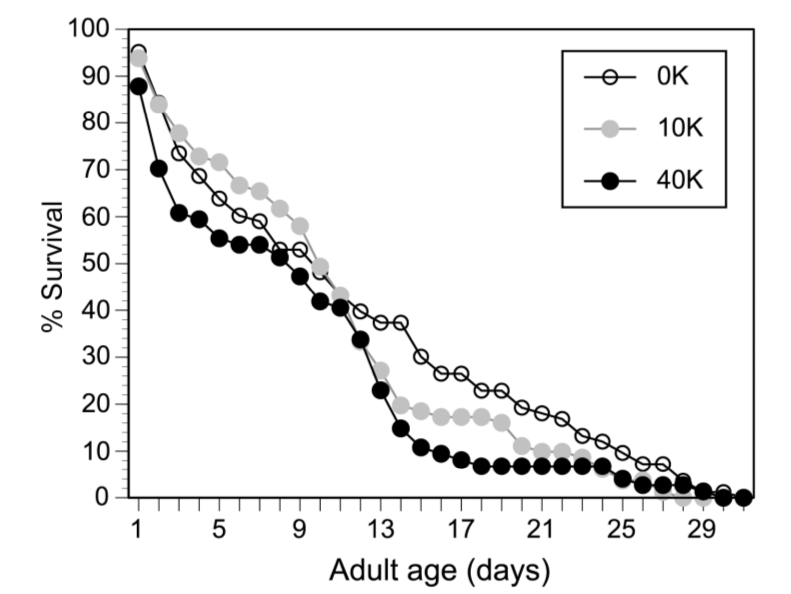

```{r setup, include=FALSE}
knitr::opts_chunk$set(echo = TRUE,  cache = T)
```

Le but de ces séances est d’apprendre à utiliser R dans des cas concrets, à produire un rapport reproductible, et à représenter des données avec R de manière optimale. Vous aborderez également l’analyse de données.

Il y aura 3 séances de 4h de TP consacrées à R :

 * 13 mars (après-midi)
 * 24 avril (après-midi)
 * 26 avril (matin)

Ce document servira pour les 3 séances.

Il a été largement inspiré du site suivant (dans lequel vous pourrez également trouver (en anglais) des exemples d'application des tests statistiques du type de ceux que vous avez pratiqués en biostatistiques) : http://www.cyclismo.org/tutorial/R/, ainsi que de ce tutoriel en français : http://larmarange.github.io/analyse-R/.

Vous progresserez à votre rythme ; un autre document attendra ceux qui iront le plus vite !

# Objectifs du TP

A la fin de ces 3 séances de TP, vous devrez être capable de maîtriser tous les points énumérés ci-dessous :


* Faire une analyse reproductible en utilisant un fichier Rmarkdown (.Rmd)
    * Connaitre les bases de la syntaxe Markdown (md)
    * Rédiger un fichier .Rmd
    * Compiler un fichier .Rmd

* Savoir utiliser Rstudio
    * Savoir se déplacer dans l'arborescence de son ordinateur
    * Maitriser le concept de dossier de travail

* Importer des données provenant d'un fichier dans un tableau (data.frame)
    * .csv, .tsv (fichier texte, qui contient un tableau dont les colonnes sont espacées par des virgules ou des tabulations)
    * .xlsx (fichier Excel)

* Savoir explorer un tableau ou data.frame
    * Connaitre le nombre de lignes, de colonnes
    * Recupérer des statistiques récapitulatives : moyenne, minimum, maximum d'une ligne/colonne

* Manipuler les tableaux
    * Sélectionner une partie d'un tableau en fonction de critères
         * sur une colonne
         * sur une liste
    * Faire des opérations simples
         * Fusionner des tableaux
         * Rajouter une ligne ou une colonne qui contient le résultat d'un calcul (ex : somme ou moyenne d'une ligne/colonne)
    
 
* Maitriser les bases du language R :
    * Connaitre et savoir utiliser les différents types de base (nombre entier, chaine de caractères, facteur, vecteur, tableau, matrice, ...)
    * Savoir installer et charger des extensions (library)
    * Savoir écrire une fonction
    * Savoir maitriser les fonctions de la famille "apply"
    * Savoir utiliser des instructions (condition if, boucle for et while, ...)
    * Faire des graphiques
  

    
> Pas de panique,  les étudiants des années précedentes y sont arrivés ! De plus cette liste pourra faciliter vos révisions et vous aider à identifier les points à travailler.

#  Rstudio et le RMarkdown

# C'est parti !

Pour continuer le TP, vous allez avoir besoin de télécharger ce document afin de le compléter :

https://github.com/msemon/TPRBioinfo/archive/master.zip

Ce dossier contient:

 * un fichier `Tp_R_L3Bioinfo.Rmd`, document que l'on pourra appeler fichier maitre ;
 * un dossier `data` qui contient tous les fichiers utilisés par ce fichier maitre.

Vous pouvez ouvrir le fichier `Tp_R_L3Bioinfo.Rmd` dans Rstudio, retrouver ce paragraphe et commencer les choses sérieuses !

Vérifier que le fichier compile bien (en appuyant sur le bouton `Knit`) ; si ce n'est pas le cas, appeler un professeur.

A chaque fois que vous ferez une modification (ou quelques unes), nous vous conseillons de compiler pour être sûr que tout fonctionne. 

> C'est vraiment parti cette fois ci, vous allez faire du R ! Continuez de lire ce document pas à pas, n'hésitez pas à exécuter le code, modifiez-le pour être sûr d'avoir bien compris, prenez le temps de faire les exercices. Si vous avez des questions ou que vous bloquez, n'hésitez pas à appeler un professeur.


# Importer des données

## Premier contact

> Puis créer de nouveaux chunks avec différentes opérations:

- soustraction : 259-57
- multiplication : 48*9
- division : 239/5

```{r}
259-57
48*9
239/5
```


> Dans un chunk, créez une variable "y" à laquelle vous assignerez le produit de 18 par 230.


```{r}
y<-18*230
y
```


##  Importer des valeurs manuellement


> Créez une variable 'petitourson' dans laquelle vous mettrez les valeurs 45.05, "youpie", et les chiffres 3 à 9. Affichez les valeurs de cette variable associées aux indices 2, 5 et 7.

```{r}
petitourson <-  c(45.05, "youpie", 3:9)
petitourson[c(2,5,7)]
```


## Importer des valeurs à partir d'un fichier

```{r}
heisenberg <- read.csv(file="data/exemples/simple.csv",head=TRUE,sep=",")
heisenberg
```


> Une autre manière d'importer les données d'un fichier est d'utiliser l'interface graphique de Rstudio (File > Import Dataset > From Csv), et de récupérer les lignes de commandes dans la section "code preview".

```{r}
library(readr)
simple <- read_csv("~/Documents/Enseignement/UE_bioinfo_L3/TP_R/2018/Poly/data/exemples/simple.csv")
simple
```


## Les extensions (library)

###  Présentation


###  Installation


## Exercices

Les données peuvent être lues dans une variable appelée "tree" en utilisant la commande read.csv. Allez-y !

```{r}
tree<-read.csv(file = "data/exemples/trees91.csv")
head(tree)
```


# Les structures élémentaires


## Les vecteurs


### Présentation des vecteurs


### Les principaux types de vecteurs

### Création

#### La fonction c

#### La fonction rep

> Créez un vecteur contenant la chaîne de caractère 'I love you' suivie de 3 fois la chaîne 'yeah', de la manière la plus élégante possible.

```{r}

y <- c('I love you', rep(c("yeah"), 3))

```


#### La fonction seq

> Créez un vecteur contenant une suite de valeurs de 50 à -50 avec un pas de -2.

```{r}
seq(50,-50, by = -2) 
```


#### L'opérateur ":"

### Longueur d'un vecteur

### Quelques vecteurs remarquables

### Combiner des vecteurs

### Valeurs manquantes

### Indexation des vecteurs

#### Indexation par position


```{r}
taille <- c(1.88, 1.65, 1.92, 1.76)
```

> Affichez toutes les valeurs d'indice pair contenues dans le vecteur "taille", de la manière la plus élégante possible.

```{r}
seq(2, length(taille), by=2)
taille[seq(0, length(taille), by=2)]
```

#### Indexation par nom

```{r}
sexe <- c(Michel = "h", Anne = "f", Dominique = NA, Jean = "h", Claude = NA, Marie = "f")
names(sexe) <- c("Michael", "Anna", "Dom", "John", "Alex", "Mary")
urbain <- c(TRUE, FALSE, FALSE, FALSE, TRUE, TRUE)
poids <- c(80, 63, 75, 87, 82, 67)
anonyme <- unname(sexe)
```

#### Indexation par condition

> Affichez les noms des personnes de sexe masculin et de poids inférieur ou égal à 82 kgs.

```{r}
sexe

poids

is_masculin <- sexe == "h"
is_masculin

is_inf_82 <- poids <= 82
is_inf_82

is_masculin & is_inf_82 

is_not_na <- ! is.na(sexe)
is_not_na

is_masculin & is_inf_82 & is_not_na

names(sexe)

names(sexe)[is_masculin & is_inf_82 & is_not_na]

names(sexe)[sexe == "h" & ! is.na(sexe) & poids <= 82]
```


### Assignation par indexation

### Opérations sur les vecteurs

#### Opérations sur les vecteurs numériques


> Créez un vecteur "minus" comprenant les entiers impairs de 5 à 25. Créez un vecteur "cortex" de la même longueur que "minus" et comprenant une répétition de la valeur "-4". Créez un vecteur "hop" égal à racine(minus)-cortex³. Affichez le résumé de ce vecteur. Triez ses valeurs de manière décroissante.

```{r}

minus = seq(5,25,by=2)
minus

cortex = rep(-4, length(minus))
cortex

hop = sqrt(minus) - cortex ^2
hop

``` 


#### Opération sur les vecteurs de chaines de caractères

### En résumé

## Les listes (list)

### Propriétés et création


> Créez une liste "titi" contenant (avec des noms) votre prénom, la couleur de vos chaussettes, et le diamètre de votre cheville gauche. Créez la liste "rominet" contenant un vecteur contenant lui-même votre jour et votre année de naissance, et votre signe astrologique chinois. Combiner ces deux listes qui contiennent ces infos fondamentales.

```{r}
titi <- list(prenom = "mémé", chaussete = "jaune", "diam_cheville" = 48)

rominet <- list(jour_naissance = "1 avril", annee_naissance = 1937)

hector = c(titi, rominet)
hector
```


### Indexation

## Les tableaux de données (data frame)

### Propriétés et création


```{r}
df <- data.frame(
  sexe =  c("f", "f", "h", "h"), 
  age = c(52, 31, 29, 35), 
  blond = c(FALSE, TRUE, TRUE, FALSE),
  stringsAsFactors = FALSE
)
row.names(df) <- c("Anna", "Mary-Ann", "Michael", "John")
df
```

### Indexation


> Affichez l'âge de Anna.

```{r}

df["Anna","age"]
```


### Afficher les données

### Opérations sur les tableaux de données

```{r}
a <- data.frame(one=c( 0,1, 2),two=c("a","a","b"))
b <- data.frame(three=c(10,11,12,4),two=c("c","c","d","a"))
```


Pourquoi la ligne suivante produit-elle une erreur ?

```{r,eval=FALSE}
rbind(a,b) 
#les noms de colonnes de a et b sont différents
```


### En résumé


## Les matrices (matrix)

### Présentation et création


### Une matrice bien utile : les tables de contingence (table)

#### Tables de contingence à une dimension


#### Tables de contingence à deux dimensions

#### Conversion vers un data frame

## Les facteurs ou vecteurs avec modalités définies (factor)


### Présentation et création

## Pratiquons, pratiquons

### Vecteurs

> Créez un vecteur contenant les chiffres 1 à 6. Affichez la classe de ce vecteur.

```{r}
x <- 1:6
x
```

> Créez un vecteur contenant les noms de quelques uns de vos camarades. Affichez la longueur de ce vecteur. Affichez les 2 premiers camarades du vecteur. Affichez le 2ème et le 3ème. Classez le vecteur par ordre alphabétique, puis par ordre alphabétique décroissant.

```{r}
n = c("Titi","Mémé","Hector","Sylvestre")
length(n)
n[c(1,2)]

sort(n)
sort(n, decreasing = T)
```

> En utilisant les fonctions rep() et seq(), créez le vecteur 'a','a',1,2,3,4,5,7,9,11.

```{r}
c(rep("a",2), seq(1,4), seq(5,11,by=2))
```

> Supprimez les valeurs manquantes du vecteur c(1,2,NA,4).

```{r}
x <- c(1,2,NA,4)
y <- x[ ! is.na(x)]
y
```

> * Créez un vecteur de 50 valeurs choisies aléatoirement et avec remise entre 1 et 100.

```{r}
x <- sample(1:100, size = 50, replace = T)
x
# Il y a bien des nombres qui ont été tirés plusieurs fois
table(sort(x))
```


> * Calculez la somme cumulative des valeurs du vecteur précédent.

```{r}
cumsum(x)
```

> * Créez la chaîne de caractère 'Les chaussettes de l'archiduchesse sont elles seches ou archi-seches'. Séparez-la en différentes sous-chaînes délimitées par le caractère 'e'. Lisez distinctement le résultat à votre voisin.

```{r}
x <- "Les chaussettes de l'archiduchesse sont elles seches ou archi-seches"
strsplit(x,split = "e")

```


### Tableaux de données

> Nous allons ici utiliser un jeu de données disponible sur R, 'iris'. Affichez la classe de ce jeu de données. Affichez le résumé du tableau de données. Affichez les 6 premières lignes du tableau. Affichez le tableau dans Rstudio. Affichez les noms des lignes, puis les noms des colonnes. Affichez le nombre de lignes et de colonnes.

```{r}
data("iris")
iris
class(iris)
summary(iris)
head(iris)
iris[1:6,]
#View(iris)
rownames(iris)
colnames(iris)
dim(iris)
nrow(iris)
ncol(iris)
```

> Affichez la 8ème ligne du tableau, puis la valeur de la 12ème ligne et 3ème colonne.

```{r}
iris[8,]
iris[12,3]
```

> Affichez les longeurs des pétales pour les lignes 10 à 15.

```{r}

iris$Petal.Length[10:15]
iris[10:15, "Petal.Length"]
```

> Affichez les longeur et largeur des sépales pour la ligne 38.

```{r}
iris[38, c("Sepal.Width", "Sepal.Length")]
```

> Affichez les numéros de ligne pour lesquelles la largeur des pétales est supérieure à 1.8.

```{r}
rownames(iris)[iris$Petal.Width > 1.8]
which(iris$Petal.Width > 1.8)
```

> Affichez les espèces pour lesquelles la longueur des sépales est supérieure à 5 et inférieure à 6.

```{r}
unique(iris$Species[iris$Sepal.Length > 5 & iris$Sepal.Length < 6])
```

> Créez une table de contingence des largeurs de sépales et espèces.

```{r}
t = table(iris$Species, iris$Sepal.Width)
t
as.data.frame.matrix(t)
```

# Graphiques de base

## Histogramme

> A partir de jeu de données "iris", tracez l'histogramme de la largeur des pétales. Indiquez le nom de l'axe des abscisses et ajoutez un titre. Ajouter un stripchart au-dessus de l'histogramme.

```{r}
hist(iris$Petal.Width,main='Titre',xlab='Petal.Width')
stripchart(iris$Petal.Width,add=TRUE,at=-0.5)
``` 

## Boxplots 

## Scatter Plots

# Application sur un premier vrai jeu de données (les chauves-souris)

Le prix Ig Nobel est attribué chaque année dans différentes disciplines ; il est dédié aux chercheurs dont les recherches "font rire, puis font réfléchir" (http://www.improbable.com/ig/winners/). Toutes les études récompensées sont méthodologiquement correctes, même si leur sujet laisse parfois sourire.

Le prix Ig Nobel de biologie a été attribué en 2010 à Libiao Zhang, Min Tan, Guangjian Zhu, Jian-
ping Ye, Tiyu Hong, Shanyi Zhou, Shuyi Zhang (Chine) et Gareth Jones (Royaume-Uni), qui ont montré
l’existence et étudié les comportements de fellation chez les chauves-souris de l’espèce C. sphinx. Ils ont filmé des chauves-souris de nuit et ont pu mettre en évidence ce comportement sexuel connu jusqu’alors uniquement chez les primates (bonobos, orang-outan et homme) : les femelles de cette chauve-souris, pendant l’accouplement, peuvent se positionner de manière à lécher la base du sexe du mâle. Le jeu de données analysé porte sur les temps relatifs de copulation et de fellation. Chaque ligne représente un accouplement, pour lequel 3 variables ont été mesurées :

* licking vaut 1 si le comportement de léchage a été observé, 0 dans le cas contraire ;
* time licking mesure le temps, en secondes, durant lequel le comportement de léchage est observé
pendant l’accouplement ;
* time copulation mesure le temps total, en secondes, qu’a duré l’accouplement, léchage inclus.

> Récupérer le jeu de données sur le portail des études (chauves-souris-fellatio-data.txt) et l'importer.

```{r}
chauvesouris=read.csv(file='data/appli1/chauves_souris_data.txt',head=T, sep=" ")
```


> Quelle commande permet d’obtenir l’affichage des 7 premières lignes du jeu de données ?

```{r}
head(chauvesouris,7)
chauvesouris[1:7,]
```

> Quelle commande permet d’obtenir le nombre de lignes et de colonnes de votre table ?

```{r}
dim(chauvesouris)
ncol(chauvesouris)
nrow(chauvesouris)
```

> Quelle commande permet d’obtenir le nom des colonnes de votre table ?

```{r}
colnames(chauvesouris)
#pour les lignes
rownames(chauvesouris)
```


> Quelle commande permet d’obtenir la moyenne des temps de copulation pour toutes les données ?

```{r}
mean(chauvesouris$time_copulation)
mean(chauvesouris$time_copulation, na.rm = T)
```

> Quelles commandes permettent de créer deux nouveaux tableaux, un pour chaque comportement ?

```{r}
lick1<- chauvesouris[chauvesouris$licking != 0,]
lick0<- chauvesouris[chauvesouris$licking != 1,]
head(lick1)

lick1<- chauvesouris[which(chauvesouris$licking != 0),]
lick0<- chauvesouris[which(chauvesouris$licking != 1),]
head(lick1)

lick1 <- subset(chauvesouris, licking == 1)
lick0 <- subset(chauvesouris, licking == 0)
head(lick1)
```


> Quelle commande permet de selectionner les lignes telles que le temps de copulation soit supérieur à 100 ?

```{r}
subset(chauvesouris, time_copulation>100)
chauvesouris[chauvesouris$time_copulation>100,]
chauvesouris[which(chauvesouris$time_copulation>100),]
```

> Quelle commande permet de selectionner les lignes telles que le temps de copulation soit supérieur à 200 et le temps de léchage inférieur ou égal à 20 ?

```{r}
subset(chauvesouris, time_copulation>200 & time_licking<=20)
chauvesouris[chauvesouris$time_copulation>200 & chauvesouris$time_licking<=20,]
chauvesouris[which(chauvesouris$time_copulation>200 & chauvesouris$time_licking<=20),]
```

> Quelle commande permet de récupérer le temps de copulation dans le cas où le temps de léchage est supérieur à 20 ?

```{r}
chauvesouris$time_copulation[chauvesouris$time_licking>20]
```

> Quelle commande permet d’obtenir la moyenne des temps de copulation par comportement ?

```{r}
tapply(chauvesouris$time_copulation, chauvesouris$licking, mean)
```

> Donner deux commandes permettant de savoir dans combien de cas le comportement de léchage a été observé.

```{r}
table (chauvesouris$licking)
tapply(chauvesouris$licking,chauvesouris$licking,length)
```

Dans l’étude, les chercheurs ont commencé par regarder s’il existait une relation entre le temps de léchage et le temps de copulation total.

> Donner la commande permettant de tracer ce graphique, sans oublier les légendes.

```{r}
plot(chauvesouris$time_licking,chauvesouris$time_copulation, xlab="Time licking", ylab="Time copulation")
```

> Rajouter une droite de régression sur ce graphique.

```{r}

# ATTENTION lm(y~x) et plot(x,y)

reg=lm(chauvesouris$time_licking~chauvesouris$time_copulation)
reg

plot(x=chauvesouris$time_copulation, y=chauvesouris$time_licking, xlab="Time licking", ylab="Time copulation")
abline(reg, col='red' )
```


Le coefficient de corrélation entre le temps de léchage et le temps de copulation (calculé sur l’ensemble des données) vaut R = 0.86, et un test statistique montre que cette valeur est significativement différente de 0.

> Recalculer la valeur du coefficient de corrélation et refaire le test. Pourquoi les chercheurs ne peuvent-ils pas en déduire que le phénomène de léchage est la cause d’un temps de copulation plus long ? (Réponse simple attendue)

```{r}
cor(chauvesouris$time_licking, chauvesouris$time_copulation)
cor.test(chauvesouris$time_licking,chauvesouris$time_copulation)

## Corrélation != Causalité
```

> Quel graphe feriez-vous pour illustrer la différence des temps de copulation entre les couples où l’on observe le phénomène de léchage et les couples où on ne l’observe pas ? Donner la (ou les) commande(s) correspondante(s).

```{r}
boxplot(chauvesouris$time_copulation~chauvesouris$licking, xlab = "Licking")
```


# Graphiques intermédiaires


## Données continues


```{r}
x <- rnorm(100,sd=5,mean=20)
y <- 2.5*x-1.0+rnorm(100,sd=9,mean=0) # ERREUR ENONCE 10 -> 100
plot(x,y)
cor(x,y)
```


### Plusieurs jeux de données sur un graphique


```{r}
x <- rnorm(50,sd=5,mean=20)
y <- 2.5*x - 1.0 + rnorm(10,sd=9,mean=0) # ERREUR ENONCE 10 -> 50

plot(x,y,xlab="Independent",ylab="Dependent",main="Random Stuff")
x1 <- runif(25,15,25)
y1 <- 2.5*x1 - 1.0 + runif(8,-6,6) # ERREUR ENONCE 8 -> 25
points(x1,y1,col=2)
```


### Barres d'erreur 


### Plusieurs graphiques sur une image


### Tracés de densité

### Colorier des régions


## Données discrètes

### Barplot


## Sauvegarder un graphique dans un fichier

## Pratiquons, pratiquons

> Importer à nouveau le jeu de données `tree` dans "data/exemples/trees91.csv"

```{r}
tree = read.csv(file="data/exemples/trees91.csv",sep=",",head=TRUE)
head(tree)
```

Pour rappel, les données contiennent des estimations de la biomasse de pin ponderosa dans une étude réalisée par Dale W. Johnson, J. Timothy Ball et Roger F. Walker (Université du Nevada). La table contient 54 lignes, et chaque ligne représente une observation. Chaque observation comprend des mesures et des marqueurs pour 28 mesures différentes d'un arbre donné.

Une description du fichier de données se trouve à http://cdiac.ornl.gov/ftp/ndp061a/ndp061a.txt (ou dans data/exemples/trees91_metadata.txt)

Par exemple, le premier chiffre de chaque rangée est un nombre, 1, 2, 3 ou 4, qui indique un niveau différent d'exposition au dioxyde de carbone. Le sixième nombre dans chaque rangée est une estimation de la biomasse des tiges de l'arbre. Notez que la toute première ligne du fichier est une liste d'étiquettes utilisées pour désigner les différentes colonnes de données.

> Sur un même graphique représenter la biomasse des tiges de l'arbre (6e colonne) en fonction de la concentration en Nitrate (N) (9e colonne) dans les tiges en colorant de manière différente les points en fonction de l'exposition au dioxyde de carbone (1e colonne). Ajouter la légende.

```{r}
#
```

> Faire un graphe pour représenter le nombre d'arbres dans chacune des catégories d'exposition au dioxyde de carbone (1e colonne).

```{r}
#
```


> Faire un graphe pour représenter la distribution de la biomasse des tiges de l'arbre (6e colonne) en fonction de l'exposition au dioxyde de carbone (1e colonne).

```{r}
#
```

 
# Introduction à la programmation

## Instructions de base

### if 

L'exécution conditionnelle est disponible en utilisant l'instruction `if`. 

```{r}
x = 0.1
if( x < 0.2)
  {
     x <- x + 1
     print("increment that number!\n")
  }
x
```

> Créez une variable contenant la chaîne de caractère de votre choix. A l'aide de l'instruction `if`, testez si cette chaîne contient la lettre "a". Si oui, écrivez "bingo!".

```{r}

```

L'instruction else peut être utilisée pour spécifier une autre option. Dans l'exemple ci-dessous, notez que l'instruction else doit être sur la même ligne que l'accolade de fin pour le bloc if précédent.


```{r}
x = 2.0
if ( x < 0.2)
 {
    x <- x + 1
    print("increment that number!\n")
 } else
 {
    x <- x - 1
    print("nah, make it smaller.\n");
 }
x
```


Enfin, les instructions if peuvent être enchaînées.

```{r}
x = 1.0
if(x < 0.2)
{
    x <- x + 1
    cat("increment that number!\n")
} else if (x < 2.0)
{
   x <- 2.0*x
   cat("not big enough!\n")
} else
{
    x <- x - 1
    cat("nah, make it smaller.\n");
}
x
```

### for

La boucle for peut être utilisée pour répéter un ensemble d'instructions.

Un exemple est donné ci-dessous:

```{r}
for(lupe in seq(0,1,by=0.3))
{
    cat(lupe,"\n");
}
x <- c(1,2,4,8,16)

for(loop in x)
{
    cat("value of loop: ",loop,"\n");
}
```

> Créer une variable initiée à la valeur 0. A l'aide d'une boucle `for`, ajoutez lui tous les multiples de 5 entre 0 et 100. Affichez le résultat.

```{r}

```

Vous verrez plus loin une autre manière de faire des itérations avec les fonctions apply qui seront alors à privilégier.


### while

La boucle while peut être utilisée pour répéter une série d'instructions, et elle est souvent utilisée lorsque vous ne savez pas à l'avance le nombre d'instructions qui seront exécutées. 

```{r}
lupe <- 1;
x <- 1
while(x < 4)
 {
    x <- rnorm(1,mean=2,sd=3)
    cat("trying this value: ",x," (",lupe," times in loop)\n");
    lupe <- lupe + 1
 }
```

> Créer une variable initiée à la valeur 2. Tant qu'elle est inférieure à 2048, multipliez-là par deux. Affichez le nombre de multiplication que vous avez fait.

```{r}

```


## Les fonctions

### Présentation

Une nouvelle fonction est créée par une construction de la forme :


```{r, eval=FALSE} 
fun_name <- function(arglist)
{
expr
}
``` 

avec :

* fun_name : le nom d’un objet où est stockéee la fonction.
* arglist : une liste d’arguments formels. Elle peut être vide (dans ce cas la fonction n'a pas d’arguments), avoir quelques noms formels séparés par des virgules, avoir des arguments de la forme nom = valeur pour donner une valeur par défaut à l'argument.
* expr : typiquement un bloc d’expressions.

Dans la fonction il peut y avoir un appel à return(val) qui arrête
la fonction et renvoie la valeur val. Si rien n’est précisé la fonction
renvoie la valeur de la dernière expression du bloc.


Par exemple: 

```{r}

somme <- function(a,b)
{ 
  return(a+b)
  }

somme(1,5)
```

La valeur retournée par la fonction est celle contenue dans `return`
ou la derniere valeur de la fonction.

```{r}
somme <- function(a,b)
{
  a+b
}

somme(1,5)

```

Vous pouvez aussi appeler d'autres fonctions dans vos fonctions :

```{r}

newDef <- function(a,b)
 {
     x = runif(10,a,b)
     mean(x)
 }
newDef(-1,1)

newDef
function(a,b)
{
   x = runif(10,a,b)
   mean(x)
}
x <- newDef(0,1)
x

```


### Arguments des fonctions 


Les arguments sont transmis dans l'ordre : R essaiera de faire correspondre les arguments nommés et de faire correspondre le reste de gauche à droite. Ils peuvent aussi être spécifiés explicitement, cependant.


```{r} 
newDef(b=10,a=1)
newDef(10,1)
```


Une autre tâche courante consiste à avoir une fonction qui renvoie plusieurs éléments. Cela peut être accompli en renvoyant une liste d'éléments. On peut accéder aux objets dans une liste en utilisant la même notation `$` utilisée pour les trames de données.

```{r}
c = c(1,2,3,4,5)
petites_stats <- function(x)
{
  m = mean(x)
  min = min(x)
  max = max(x)
  len = length(x)
  return(list(min=min,max=max,len=len,mean=mean))
}
result <- petites_stats(c)
result
result$min
result$mean
```


Un autre problème potentiel peut survenir lors de l'utilisation d'une fonction dans R. Si une variable précédemment indéfinie apparaît, R regardera la liste des arguments de la fonction. Ensuite, il regardera dans l'espace de travail actuel. Si vous ne faites pas attention, R trouvera la valeur à un endroit où vous ne l'attendez pas, et votre fonction retournera une valeur qui n'est pas correcte. Soyez très prudent sur les noms des variables, en particulier lorsque vous utilisez des fonctions.


### Pratiquons, pratiquons


#### Exercice 1

> Faire une fonction "paire" qui prend un nombre x, et renvoie TRUE ou FALSE si ce nombre est pair.


```{r,eval=F}
paire <- function(x) {
  [...]
  return()
}
```


```{r ,eval=F}
paire(2)
paire(5)
paire(2.3)
```


> Faire une fonction "somme_carre"" qui prend 2 nombres x et y, et renvoie la somme des carrés de ces 2 nombres.


```{r,eval=F}
somme_carre <- function(x,y) {
  [...]
  return()
}
```

```{r ,eval=F}
somme_carre(2,563)
somme_carre(7,95)
somme_carre(-2, 4)
```


> Faire une fonction qui trace un histogramme, l'enregistre en pdf, en mettant la couleur et le titre en option. 

```{r,eval=F}
trace_histo <- function(x,file="histo.pdf",[...]) {
  [...]
}
```

```{r ,eval=F}
x=runif(1000)

trace_histo(x, file="histo.pdf",titre="Super titre",couleur="red")
```


> Faire une fonction "filtre_positif" qui prend un vecteur de nombres, et renvoie les valeurs positives.

```{r ,eval=F}

```


#### Exercice 2

> Créer	une	séquence d'ADN aléatoire de	1000 nucléotides. Combien de	fois est présent chaque	nucléotide ?	

```{r ,eval=F}

```

> Lancer cette fonction 1000 fois et représenter la distribution du nombre de "A". Ajouter une verticale sur le graphique qui montre la moyenne attendue. Mettre un titre.
  	
> Encapsuler la manip précédente dans une fonction, qui prend le nucléotide demandé en argument, une couleur pour le graphique et le sauve.

> Appliquer cette fonction pour tous les nucléotides.


### Precicions sur les fonctions


#### L’argument spécial point-point-point

L'argument point-point-point (...) permet à une fonction d'accepter un nombre quelconque d’arguments.
L'argument point-point-point indique que la fonction accepte n'importe quoi d’autre comme argument.
Ce qu’il adviendra de ces arguments est déterminé par la fonction.
En général ils sont transmis à d'autres fonctions.
Par exemple, une fonction graphique de haut niveau transmettra l’argument point-point-point à des fonctions graphiques de bas niveau pour traitement.

Supposons que nous voulions définir une fonction qui dessine un nuage de points et y ajoute une droite de régression :

```{r, eval=FALSE} 
f <- function(x, y, ...) {
plot.default(x = x, y = y, ...)
abline(coef = lm(y~x)$coef)
}
f(1:10,1:10)
```

Comme nous avons transmis l’argument point-point-point à plot.default(), tout ce que plot.default() sait faire, la fonction f() sait le faire également.

```{r, eval=FALSE} 
f(1:10, 1:10, main = "Titre de ce graphique", pch = 19, col = "blue",
las = 1, panel.first = grid(col = "pink", lty = "solid"))
```

#### Illustration de la neutralisation de l’affichage automatique dans les fonctions

Si l'on souhaite afficher des choses dans une fonction (bien pratique pour débugguer), utiliser la fonction print.

```{r, eval=FALSE} 
f1 <- function(x = pi) { x ; 0}
f1()
[1] 0
f2 <- function(x = pi) { print(x) ; 0}
f2()
```

#### Détermination de la valeur d'une variable dans une fonction


Quand une expression fait appel à une variable, comment la valeur de cette variable est-elle déterminée ?

Si une variable n’est pas trouvée à l’intérieur de la fonction, elle est recherchée en dehors de la fonction. Tout ce que l’on a à retenir est qu'une variable définie à l'exterieur de la fonction est accessible aussi dans la fonction.
Si deux variables avec le même nom sont définies à l'intérieur et à l'extérieur de la fonction, c’est la variable locale qui sera utilisée.
Une erreur aura lieu si aucune variable avec le nom demandé n’est trouvée.

```{r, eval=FALSE} 
mavariable <- 1
mafonction1 <- function() {
mavariable <- 5
print(mavariable)
}
mafonction1()
mavariable
mafonction2 <- function() {
print(mavariable)
}
mafonction2()
```


### La famille des fonctions apply (comment faire une boucle en R)

Les différentes versions des commandes apply permettent de prendre une fonction et d'exécuter une opération sur chaque partie des données. Il existe une grande variété de ces commandes, mais nous n'en examinons que deux. Le premier ensemble, lapply et sapply, est utilisé pour appliquer une fonction à chaque élément d'une liste. Le deuxième, tapply, est utilisé pour appliquer une fonction sur chaque ensemble divisé par un ensemble donné de facteurs.

#### Opérations sur les listes et les vecteurs

Tout d'abord, la commande lapply est utilisée pour prendre une liste d'éléments et effectuer une fonction sur chaque membre de la liste. Autrement dit, la liste comprend un certain nombre d'objets différents. Vous voulez effectuer une opération sur chaque objet de la liste. Vous pouvez utiliser lappply pour indiquer à R de parcourir chaque élément de la liste et d'effectuer l'action souhaitée sur chaque élément.

```{r, eval=FALSE}
lapply(list(9,16,24), sqrt)
lapply(list(1,2,3), function(x){x*x})
```


> Faire une fonction qui renvoie la somme des carrée d'une liste de nombres.

```{r, eval=FALSE}
somme_carre_list <- function( ... ) {
  ...
}

somme_carre_list(list(1,2,3,4,5,6))

```


Dans l'exemple suivant, une liste est créée avec trois éléments. Le premier est un ensemble de nombres générés aléatoirement avec une distribution normale. Le second est un ensemble de nombres générés aléatoirement avec une distribution exponentielle. Le dernier est un ensemble de facteurs. Un résumé est ensuite effectué sur chaque élément de la liste.

```{r,eval=FALSE}
x <- list(bibi=rnorm(200,mean=1,sd=10),
            bobo=rexp(300,10.0),
            babar=as.factor(c("a","b","b","b","c","c")))
lapply(x,summary)
```

La commande lapply retourne une liste. Les entrées de la liste portent le même nom que les entrées de la liste qui lui est transmise en entrée. Les valeurs de chaque entrée sont les résultats de l'application de la fonction. La fonction sapply est similaire, mais la différence est qu'elle essaie de transformer le résultat en un vecteur ou une matrice si possible. Si cela n'a pas de sens, alors il retourne une liste comme la commande lapply. 

```{r,eval=FALSE}
x <- list(a=rnorm(8,mean=1,sd=10),b=rexp(10,10.0))
x
val <- lapply(x,mean)
typeof(val)
val
val$a
val$b
other <- sapply(x,mean)
typeof(other)
other
other[1]
other[2]
```


#### Opérations groupées par modalités d'un facteur

La fonction tapply prend une liste de données, généralement un vecteur, un facteur, et une fonction. Il applique ensuite la fonction à chaque sous-ensemble de données correspondant à chaque modalité du facteur.

```{r,eval=FALSE}
val <- data.frame(a=c(1,2,10,20,5,50),
                    b=as.factor(c("a","a","b","b","a","b")))
val
result <- tapply(val$a,val$b,mean)
typeof(result)
result
result[1]
result[2]
result <- tapply(val$a,val$b,summary)
typeof(result)
result
result$a
```


#### Opérations sur un tableau

La fonction apply prend un tableau, et une fonction. Elle peut appliquer la fonction soit sur les lignes, soit sur les colonnes, soit sur les deux ; par exemple elle permet de calculer la somme d'un tableau ligne par ligne ou colonne par colonne. 

```{r,eval=FALSE}
val <- data.frame(a=runif(10,1,10),
                    b=runif(10,1,10),
                  c=runif(10,1,10))
val

val$mean = apply(val,1,mean)

val

val["total",] = apply(val,2,sum)
val

```

> Faire la meme chose sur val2.

```{r,eval=FALSE}
val2 <- data.frame(name=LETTERS[1:10],
                  a=runif(10,1,10),
                    b=runif(10,1,10),
                  c=runif(10,1,10))
val2

```

### Pratiquons, pratiquons

#### Exercice 3

> Chargez le tableau 'iris'. Créez un vecteur contenant autant d'éléments que de lignes dans le tableau, dans lequel vous placerez la chaîne "plus grand que 5" si la longueur des sépales est supérieure à 5, et la chaîne "moins grand que 5" dans le cas contraire. Faites le de deux manières différentes, à l'aide d'une boucle for.

#### Exercice 4

> Reprenez l'exercice précédent en utilisant cette fois-ci la fonction "apply".

> Pour chaque fleur, calculez, à l'aide de "apply", le produit de la longueur des pétales par leur largeur.


## Exécuter un fichier

### Exécuter les commandes dans un fichier

Un ensemble de commandes R peut être enregistré dans un fichier, puis exécuté comme si vous l'aviez tapé depuis la ligne de commande. La commande source est utilisée pour lire le fichier et exécuter les commandes dans la même séquence que celle donnée dans le fichier.

```{r, eval=FALSE} 
source('file.R')
``` 
 
Si vous générez simplement le fichier, les commandes ne sont pas imprimées et les résultats des commandes ne sont pas imprimés. Cela peut être remédié en utilisant les options echo , print.eval et verbose.

Certains exemples sont donnés en supposant qu'un fichier, simpleEx.R , se trouve dans le répertoire courant. Le contenu du fichier est donné ci-dessous:

```{r}
 # Define a variable.
x <- rnorm(10)

# calculate the mean of x and print out the results.
mux = mean(x)
cat("The mean of x is ",mean(x),"\n")

# print out a summary of the results
summary(x)
cat("The summary of x is \n",summary(x),"\n")
print(summary(x))
```

Le fichier montre également l'utilisation de # pour spécifier des commentaires. Tout ce qui suit le # est ignoré. En outre, le fichier illustre l'utilisation de cat et print pour envoyer les résultats à la sortie standard. 
 


# Application sur un second jeu de données (lézards)


Le  lézard des murailles (\textit{Podarcis muralis}) est très commun en Europe. 
Son dos est d'une ennuyeuse couleur brune, probablement pas très visible des prédateurs. Par contre, le ventre des mâles peut prendre des couleurs fabuleuses. Tous les lézards muraux n'ont pas la même couleur, certains sont oranges, d'autres blancs ou jaunes. Les chercheurs ont récemment proposé que ces couleurs ont une fonction dans la signalisation sociale. Le lézard pourrait garder ses «vraies couleurs» cachées, loin des regards indiscrets des prédateurs, et les montrer aux autres lézards au moment approprié. 

La selection sexuelle est l'un des principaux processus inpliqués dans l'émergence et le maintien des polymorphismes avec des variations de couleurs dans de nombreux taxa. Si c'est le cas ici, on s'attend à ce que l'intensité de la sélection sexuelle dans les populations soit corrélée avec l'importance du polymorphisme dans les populations. 


Ici vous allez tester si l'intensité de la sélection sexuelle, estimée à partir du sex ratio, prédit la diversité des morphes chez \textit{Podarcis muralis}.

{ width=50% }


> Importer le jeu de données contenu dans "data/appli2/lezard.csv" et afficher les 5 premières lignes.

```{r, eval=FALSE} 
# A vous de jouer
``` 

Chacune des lignes représente une population où des individus ont été capturés. Le nombre de mâles, de femelles ainsi que le nombre de morphes observés a été répertorié. La colonne "richness" correspond au nombre de morphes dans la population et la colonne "eveness" correspond à la « régularité » de la répartition du nombre d'individus entre les morphes.


> Calculer le nombre de populations (colonne "poblacio" dans la table), le nombre total de femelles, le nombre total de mâles, le nombre total d'individus.
  
```{r, eval=FALSE} 
# A vous de jouer (etc)
``` 


> Construire une nouvelle colonne contenant le sex ratio pour chacune des populations. Quels sont le minimum, la moyenne et le maximum  des sex ratio observés dans les populations ? 

$$ Sex ratio = \frac{Nb_{male}}{Nb_{femelle}} $$


> Restreindre votre jeu de données aux populations qui ont 50 lézards ou plus. Quelles populations passent le seuil ?

> Représenter en fonction du nombre de morphes (colonne "richness") la distribution des sex ratio. Qu'est-ce que vous observez ?

> Représenter la « régularité » de la répartition du nombre d'individus entre les morphes (eveness) en fonction du sex ratio. Ajouter sur le graphe une droite de tendance. Que pouvez-vous conclure ?

> Importer maintenant le jeu de données contenu dans "data/appli2/lezard2.csv". Il contient les caractéristiques (populations, morph, sexe) de chaque individu. Calculer le nombre de morphe pour chacun des sexes par population.

L'indice de shannon est un indice permettant de mesurer la diversité spécifique. 
Sa formule est:

$$ S = - \sum \limits_{i=1}^n p_i ln(p_i)$$ avec $n$ le nombre de morphes dans la population et $p_i$  la proportion du $i^{eme}$ morphe dans la population

> Faire une fonction pour calculer cet indice puis calculez-le pour chacune des populations.

> Avez vous bien utilisé la famille apply, et la fonction "table" ? Sinon, corrigez les lignes suivantes pour le faire :

```{r, eval=FALSE} 
calc_shannon <- function(x) {
  p = length(x)
  p=p[p>0]
  s = p
  return(s)
}

shannon_l = tapply(x, x, calc_shannon)
``` 

> Représenter l'indice de shannon en fonction du sex ratio. Ajouter sur le graphe une droite de tendance. Que pouvez vous conclure ?

> Faire de-même en calculant l'indice de shannon par sexe. Que pouvez vous conclure ?


# Application sur un troisième jeu de données (les abeilles) et initiation à ggplot2

Nosema ceranae est un champignon microscopique, qui provoque une maladie répandue chez abeilles.
Ce microchampignon n'existe hors des cellules de son hôte que sous la forme de spores métaboliquement inactives. Ces spores, infectieuses, permettent la transmission de maladies entre individus. 

{ width=30% }	

Daren Eiri et ses collaborateurs (PLOS One, 2015; doi:10.1371/journal.pone.0126330) ont exposé des larves d'abeille de trois jours à une dose unique de spores de \textit{Nosema ceranae} de 40 000 (40 K), 10 000 (10 K), zéro ou 40 K autoclavée.
Ils ont ensuite compté le nombre de spores chez les larves d'abeilles de 8 jours, et chez les adultes, ainsi que mesuré la durée de vie des abeilles.


> Importer le jeu de données contenu dans "data/appli3/NosemaS1_Table.xls" et afficher les 5 premières lignes.


Chacune des lignes représente une abeille étudiée. L'identifiant de la colonie, et le poids de l'abeille à l'émergence ont été répertoriés.

> Calculer :

  * le nombre total d'abeilles
  * le nombre d'abeilles par type de traitement
  * le poids moyen des abeilles, en mg par traitement (le stocker dans une nouvelle colonne de la table) : avez-vous l'impression qu'il soit différent ?
  
> Représenter la distribution du poids en mg en fonction de la colonie.

> Faire une fonction qui représente, pour une colonie donnée, la distribution du poids en fonction du traitement.

# Démarrage de ggplot2 en douceur...


```{r, eval=FALSE} 
library(ggplot2)
p = ggplot(data = df1, aes(y = `Bee weight (g)`, x = `Treatment (# spores)`))
p
```

Aucun graphique ne s’affiche ici : en effet, ce que l’on a stocké, dans l’objet p, n’est pas un graphique complet, mais une base de travail. Cette base définit les coordonnées y du graphique dans l’argument aes (aesthetics). 


Rajoutons désormais un objet géométrique, geom_point, qui va projeter, sur le graphique, des points aux coordonnées précédemment définies.

```{r, eval=FALSE} 
p + geom_point()
```

Divisons le graphique en projetant les points de chaque colonie dans une facette différente du graphique. Utiliser facet_grid :


```{r, eval=FALSE} 
p + geom_point()+facet_grid(.~ `Colony Label`)
```

Le graphique ci-dessus présente un problème fréquent : l’axe horizontal du graphique est illisible. Grâce à l’argument scale_x_continuous, on va pouvoir clarifier cet axe en n’y faisant figurer que certaines valeurs :

```{r, eval=FALSE} 
p + geom_point() +
  facet_grid(. ~ `Colony Label`) +
  scale_x_continuous(breaks = c(0, 10000, 40000))
```

Ensuite on peut aussi changer les étiquettes des axes, c'est nettement plus joli, non ? Ha bon, tant pis.

```{r, eval=FALSE} 
p + geom_point() +
  facet_grid(. ~ `Colony Label`) +
  scale_x_continuous(breaks = c(0, 10000, 40000), labels=c("0","1e4","4e4"))
```

On souhaite encore procéder à une dernière modification, en rajoutant une régression locale à travers les points de chaque facette. Pas que ça ait grand sens, sur 3 concentrations, mais bon. Au passage, si on modifie l'objet p, on a moins de lignes à copier-coller.

```{r, eval=FALSE} 
 p <- p + geom_point() +
  facet_grid(. ~ `Colony Label`) +
  scale_x_continuous(breaks = c(0, 10000, 40000), labels=c("0","1e4","4e4"))

p + geom_smooth(method = "loess", se = FALSE,
                size = 1, color = "black")
```                
    
Si on veut des axes in french : 
                
```{r, eval=FALSE} 
 p +
 geom_smooth(method = "loess", se = FALSE,
                size = 1, color = "black") + 
  labs(x= "Traitement (nb spores)",y = "Poids des abeilles (g)\n")
```                


Si on aime la sobriété des couleurs :

```{r, eval=FALSE} 
 ggplot(data = df1, aes(y = `Bee weight (g)`, x = `Treatment (# spores)`)) + geom_point(color = "grey50") +
  facet_grid(. ~ `Colony Label`) +
  scale_x_continuous(breaks = c(0, 10000, 40000), labels=c("0","1e4","4e4"))+
geom_smooth(method = "loess", se = FALSE,
                size = 1, color = "black") + 
labs(x= "Traitement (nb spores)",y = "Poids des abeilles (g)\n")+
      theme_bw() +
  theme(strip.background = element_rect(fill = "grey90", color = "grey50"),
        strip.text = element_text(size = rel(1)),
        panel.grid = element_blank())
```         

Pourquoi pas un boxplot, soyons fous. Attention pour les boxplots il faut donner un factor en x. Mais sinon on a basculé très facilement de la visualisation sous forme de niveaux de traitements à une visualisation par boxplots. Ces basculements sont très faciles à envisager dès que l’on maîtrise les principaux éléments de ggplot2. Ca tombe bien : plus qu'un dernier exercice, et vous attaquez le TP ggplot2.

```{r, eval=FALSE} 
ggplot(data = df1, aes(y = `Bee weight (g)`, x = factor(`Treatment (# spores)`)))+ geom_boxplot() +
facet_grid(. ~ `Colony Label`) +
scale_x_discrete(labels = c("0","+","++"))+
labs(x= "Traitement (nb spores)",y = "Poids des abeilles (g)\n")

```   


> Importer maintenant le jeu de données dans "NosemaS4_Table.xls" et afficher les 5 premières lignes (qui correspondent aux 5 premières abeilles). La première colonne est le traitement, la seconde est la durée de vie de l'abeille.

> Reproduire la Figure 3 de l'article Eiri et al. 

{ width=50% }


Pour cela il est possible de procéder par étapes:

* Fabriquer un vecteur qui contient les ages en jours de 1 à 40
* Récupérer la sous-table qui contient les abeilles contrôles
* Fabriquer une fonction qui compte, pour un âge donné, la proportion d'abeilles qui ont survécu au moins jusqu'à cet âge
* Appliquer cette fonction à tous les âges
* Faire un graphique qui montre les aâs en fonction des pourcentages de survie pour les contrôles
* Ajouter sur le graphique les pourcentages de survie pour les 10K, et 40K.
* Ajouter les légendes
* Enregistrer votre figure au format pdf


# Où trouver de l'aide plus tard ?

Lors de ce TP vous pouvez poser toutes les questions que vous voulez aux professeurs mais comment faire plus tard ?

## Aide en ligne
**R** dispose d'une aide en ligne très complète, mais dont l'usage n'est pas forcément très simple. D'une part car elle est intégralement en anglais, d'autre part car son organisation prend un certain temps à être maîtrisée.

### Aide sur une fonction

La fonction la plus utile est sans doute `help` (ou son équivalent `?`) qui permet d'afficher la page d'aide liée à une ou plusieurs fonctions. Celle-ci permet de lister les arguments de la fonction, d'avoir des informations détaillées sur son fonctionnement, les résultats qu'elle retourne, etc.

Pour accéder à l'aide de la fonction `mean`, par exemple, il vous suffit de saisir directement :

```{r, eval=FALSE, tidy=FALSE}
?mean
```

ou bien

```{r, eval=FALSE}
help("mean")
```

## Ressources sur le Web

De nombreuses ressources existent en ligne, mais la plupart sont en anglais, il faudra donc formuler vos requêtes en anglais.

### Moteur de recherche

Le fait que le logiciel s'appelle **R** ne facilite malheureusement pas les recherches sur le Web... La solution à ce problème a été trouvée grâce à la constitution d'un moteur de recherche *ad hoc* à partir de **Google**, nommé **Rseek** : http://www.rseek.org/.

Les requêtes saisies dans **Rseek** sont exécutées dans des corpus prédéfinis liés à **R**, notamment les documents et manuels, les listes de discussion ou le code source du programme.


### Antisèches (cheatsheet)

On peut trouver un peu partout sur internet des antisèches (*cheatsheets* en anglais) qui sont 
en général un fichier **PDF** résumant les principales fonctions d'une extension ou
d'une problématique donnée. Ces antisèches peuvent être imprimées afin de les avoir facilement 
à portée de main.

Pour les trouver, il suffit d'effectuer une recherche **Google** avec les mots-clés
`R cheatsheet` ou `<pkg> cheatsheet` en remplacant `<pkg>` par le nom du package qui
nous intéresse.

Certaines sont également disponibles directement dans **RStudio**, dans le menu `Help > Cheatsheets`.


### Aide en ligne

Le site **R documentation** propose un accès clair et rapide à la documentation de **R** et des extensions hébergées sur le **CRAN** (ainsi que certaines extensions hébergées sur **GitHub**). Il permet notamment de rechercher et naviguer facilement entre les pages des différentes fonctions : www.rdocumentation.org.

### Ressources officielles

La documentation officielle de **R** est accessible en ligne depuis le site du projet : www.r-project.org.
Les liens de l'entrée *Documentation* du menu de gauche vous permettent d'accéder à différentes ressources.

Les *manuels* sont des documents complets de présentation de certains aspects de **R**. Ils sont accessibles
en ligne, ou téléchargeables au format **PDF** :<br /><http://cran.r-project.org/manuals.html>.

On notera plus particulièrement *An introduction to R*, normalement destiné aux débutants, mais qui
nécessite quand même un minimum d'aisance en informatique et en statistiques :<br />
<http://cran.r-project.org/doc/manuals/R-intro.html>.

*R Data Import/Export* explique notamment comment importer des données depuis d'autres logiciels :<br />
<http://cran.r-project.org/doc/manuals/R-data.html>.

### Ouvrages, blogs, MOOCs...

Parmi les ressources en français, on peut citer notamment [R et espace](https://framabook.org/r-et-espace/), manuel d’initiation à la programmation avec R appliqué à l’analyse de l’information géographique, librement téléchargeable en ligne. 

La très bonne *Introduction à R et au tidyverse* de Julien Barnier disponible sur <https://juba.github.io/tidyverse/>.

La section [Contributed documentation](https://cran.r-project.org/other-docs.html) du site officiel de R contient également des liens vers différents documents en français, plus ou moins accessibles et plus ou moins récemment mis à jour.

Le pôle bioinformatique lyonnais (PBIL) propose depuis longtemps une somme très importante de documents, qui comprend des cours complets de statistiques utilisant R :

- [http://pbil.univ-lyon1.fr/R/](http://pbil.univ-lyon1.fr/R/)

Plusieurs blogs francophones autour de R sont également actifs, parmi lesquels :

- [ElementR](https://elementr.hypotheses.org/), le blog du groupe du même nom, qui propose de nombreuses ressources sur R en général et en particulier sur la cartographie ou l'analyse de réseaux.
- [R-atique](http://perso.ens-lyon.fr/lise.vaudor/), blog animé par Lise Vaudor, propose régulièrement des articles intéressants et accessibles sur des méthodes d'analyse ou sur des extensions R.


Enfin, le site *France Université Numérique* propose régulièrement des sessions de cours en ligne, parmi lesquels une  [Introduction à la statistique avec R](https://www.fun-mooc.fr/courses/course-v1:UPSUD+42001+session08/about) et un cours sur l'[Analyse des données multidimensionnelles](https://www.fun-mooc.fr/courses/agrocampusouest/40001S03/session03/about).

On peut aussi citer :

* [Logiciel R et programmation](http://egallic.fr/Enseignement/R/m1_stat_eco_logiciel_R.pdf) par @3wen
* [Programmer en R](https://fr.wikibooks.org/wiki/Programmer_en_R), wikibook collaboratif (licence CC-BY-SA)
* [R et espace](https://framabook.org/r-et-espace/) : manuel d’initiation à la programmation avec R appliqué à l’analyse de l’information géographique, librement téléchargeable en ligne.
* [Introduction à la programmation en R](https://cran.r-project.org/doc/contrib/Goulet_introduction_programmation_R.pdf)
* [C'est l'enfeR](https://bioinfo-fr.net/cest-lenfer) donne des exemples de code simple avec R qui donnent des résultats surprenants.

Et enfin, une liste de ressources francophones : <https://github.com/frrrenchies/frrrenchies/>.


### Ressources francophones

Il existe des ressources en français sur l'utilisation de **R**, mais peu sont réellement destinées aux débutants, elles nécessitent en général des bases à la fois en informatique et en statistique.

Le document le plus abordable et le plus complet est sans doute *R pour les débutants*, d'Emmanuel
Paradis, accessible au format **PDF** :<br /><http://cran.r-project.org/doc/contrib/Paradis-rdebuts_fr.pdf>.

La somme de documentation en français la plus importante liée à **R** est sans nulle doute celle mise
à disposition par le Pôle bioinformatique lyonnais. Leur site propose des cours complets de statistique
utilisant **R** :<br /><http://pbil.univ-lyon1.fr/R/enseignement.html>.

La plupart des documents sont assez pointus niveau mathématique et plutôt orientés biostatistique,
mais on trouvera des documents plus introductifs ici :<br /><http://pbil.univ-lyon1.fr/R/html/cours1>.


### StackOverflow

Le site **StackOverflow** (qui fait partie de la famille des sites **StackExchange**) comprend une section
(anglophone) dédiée à **R** qui permet de poser des questions et en général d'obtenir des réponses assez
rapidement :<br /><http://stackoverflow.com/questions/tagged/r>.

La première chose à faire, évidemment, est de vérifier que sa question n'a pas déjà été posée.


# Sources

http://larmarange.github.io/analyse-R/intro-ggplot2.html

http://www.cyclismo.org/tutorial/R/

